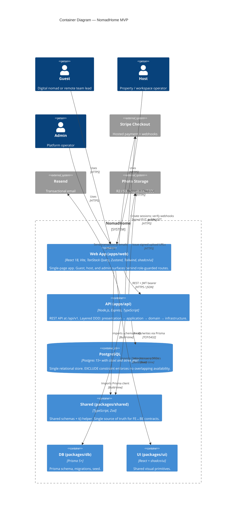
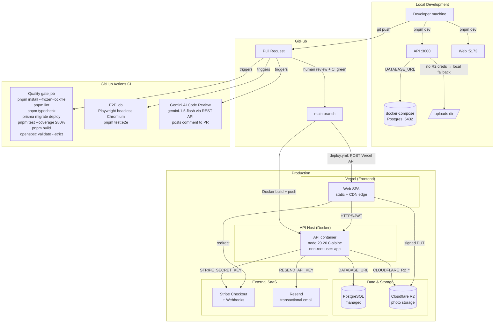

# NomadHome

A Co-living and Workspace platform

## Table of Contents

0. [Project Overview](#0-project-overview)
1. [Product Description](#1-product-description)
2. [System Architecture](#2-system-architecture)
3. [Data Model](#3-data-model)
4. [API Specification](#4-api-specification)
5. [User Stories](#5-user-stories)
6. [Work Tickets](#6-work-tickets)
7. [Pull Requests](#7-pull-requests)

---

## 0. Project Overview

### **0.1. Full Name:**

- Luciano Ramello

### **0.2. Project Name:**

- NomadHome

### **0.3. Brief Project Description:**

- A Co-living and Workspace platform.

### **0.4. Project URL:**

> It can be public or private. If private, share access securely. You can send them to [alvaro@lidr.co](mailto:alvaro@lidr.co) using a service like [onetimesecret](https://onetimesecret.com/).

### 0.5. Repository URL or Compressed Archive

- https://github.com/luchosr/NomadHome

---

## 1. Product Description

### **1.1. Objective:**

NomadHome is a SaaS marketplace that connects digital nomads, remote teams, and distributed workers with co-living spaces and workspaces — and the property hosts and operators that supply them.

**Problem solved.** Nomad housing today is fragmented across Airbnb (optimized for nightly stays, hostile to longer ones), individual co-living operators (hard to compare, no portable identity or review history), separate coworking platforms (when you only need a desk), and informal Facebook/Slack channels (no trust signals). On the supply side, independent operators lack a focused channel to reach the nomad audience.

**Who it's for.**

- **Digital nomads and remote workers** booking 1-week to 3-month stays across cities, who value flexibility and community.
- **Remote team leads** booking group accommodation and workspace for a distributed-team offsite.
- **Property hosts and small co-living operators** looking for a focused channel without the longer-stay tax of Airbnb.
- **Platform admins** moderating the marketplace at the minimum needed to keep it trustworthy.

**Value delivered.**

- **One place** to discover, book, pay, and review longer stays — replacing the patchwork above.
- **A basic trust layer** (verified email, reviews, role-based access) appropriate for the MVP audience size.
- **All-inclusive pricing** with a transparent split fee model (guest service fee + host commission).
- **A focused supply channel** for hosts whose inventory is mispriced or misclassified on generic platforms.

**MVP philosophy.** The MVP is a **learning vehicle**, not a growth vehicle. Success is measured by completed end-to-end stays and the depth of qualitative feedback from both sides ([docs/PRD.md](docs/PRD.md) §4) — not by GMV, MRR, or vanity volume metrics. Full positioning and non-goals in [docs/PRD.md](docs/PRD.md) §§1–3.

### **1.2. Main Features and Functionality:**

The MVP delivers ten capabilities, each scoped to the minimum that proves the end-to-end booking loop. Source of truth: [docs/PRD.md](docs/PRD.md) §6 and [docs/tasks.md](docs/tasks.md).

| #   | Capability       | What it delivers in MVP                                                                                                                                                                                                                                                                                                                                                                                                                                                                                                                                                                                                          |
| --- | ---------------- | -------------------------------------------------------------------------------------------------------------------------------------------------------------------------------------------------------------------------------------------------------------------------------------------------------------------------------------------------------------------------------------------------------------------------------------------------------------------------------------------------------------------------------------------------------------------------------------------------------------------------------- |
| 1   | **Identity**     | Email/password registration with email verification; login with short-lived JWT access tokens + revocable refresh tokens stored in `httpOnly` cookies; roles `guest` / `host` / `admin` (a single account can hold multiple); auth audit log for `registered`, `login_succeeded`, `login_failed`, `role_added`, `user_disabled`.                                                                                                                                                                                                                                                                                                 |
| 2   | **Listings**     | Hosts create, edit, publish, and unpublish properties (co-living) and workspaces (hot desks, meeting rooms) with title, description, type, city, capacity, nightly rate, photos (signed-URL upload), and amenities. Listings move through `DRAFT → PUBLISHED → DISABLED` with invariants enforced in the domain layer (no publishing without a photo, amenity, and non-zero rate).                                                                                                                                                                                                                                               |
| 3   | **Search**       | Guests search published listings by city + date range. Filter by price range, type, amenities (AND semantics), and capacity. Results are paginated, URL-state-synced so they're shareable, and exclude any listing whose `AvailabilityBlock` rows overlap the requested range.                                                                                                                                                                                                                                                                                                                                                   |
| 4   | **Booking**      | Instant booking with atomic hold: a `Booking (PENDING_PAYMENT)` and its `AvailabilityBlock (BOOKING_HOLD)` are inserted in one transaction guarded by a Postgres `EXCLUDE USING gist` constraint — concurrent double-booking is structurally impossible. Guests can cancel before check-in; refund amount is computed per cancellation policy and queued as `RefundRequest (PENDING_ADMIN)`.                                                                                                                                                                                                                                     |
| 5   | **Payments**     | Stripe Checkout (hosted) for guest payment — NomadHome never touches card data. Platform charges a configurable **split fee**: a guest service fee added on top of the host price, plus a host commission deducted from the host's payout. Both fees are snapshotted on the booking at creation time so future config changes never retro-alter existing bookings. Webhooks (`checkout.session.completed`, `checkout.session.expired`) are signature-verified and idempotent via a `StripeProcessedEvent` dedup table. Host payouts are **manual** in MVP: admins see what is owed per host and record the out-of-band transfer. |
| 6   | **Reviews**      | One guest review per completed booking (1–5 stars + optional free text, max 2000 chars), enforced by `Review.bookingId UNIQUE`. `Listing.averageRating` and `Listing.reviewCount` are recomputed in the same transaction as the review insert.                                                                                                                                                                                                                                                                                                                                                                                   |
| 7   | **Host tooling** | Minimal host dashboard listing own listings (all statuses) and upcoming bookings sorted by check-in. Guest PII minimized to first name + last initial.                                                                                                                                                                                                                                                                                                                                                                                                                                                                           |
| 8   | **Admin**        | Role-guarded admin surface (no separate `apps/admin` in MVP). Disable users with cascading effects: hide their listings, flag affected confirmed bookings, revoke all refresh tokens. Disable listings with notice emails to affected guests/hosts. Compute and record manual host payouts.                                                                                                                                                                                                                                                                                                                                      |
| 9   | **Platform**     | English-only, mobile-responsive web. All user-facing strings routed through a `t(key)` helper backed by a single English lookup table so future i18n is an integration, not a refactor.                                                                                                                                                                                                                                                                                                                                                                                                                                          |
| 10  | **Compliance**   | bcrypt (cost ≥12) for passwords; HTTPS in production; refresh tokens stored as hashes; auth event audit log; PII minimization on host-facing endpoints; rate limits on auth endpoints.                                                                                                                                                                                                                                                                                                                                                                                                                                           |

**Explicitly not in MVP** ([docs/PRD.md](docs/PRD.md) §3.2 and Appendix A): native mobile, PWA, i18n beyond English, OAuth, in-app messaging, push notifications, calendar sync, automated payouts, refund automation, community features, roommate matching, dynamic pricing, channel manager integrations, analytics dashboards, dispute resolution, public partner API, ID verification, host-to-guest reviews, group bookings as a first-class object.

### **1.3. Design and User Experience:**

> Provide images and/or video tutorial showing the user experience from when they land on the application, through all main functionalities.

### **1.4. Installation Instructions:**

**Prerequisites**: Node.js ≥ 20.19.0 and pnpm. The repo pins its pnpm version via the `packageManager` field — run `corepack enable` once and pnpm will use the pinned version automatically.

```bash
# 1. Install dependencies (whole workspace)
pnpm install

# 2. Run the app in dev mode
pnpm dev            # builds shared/ui first, then starts api + web together
pnpm dev:api        # backend only (apps/api) — still builds its deps first
pnpm dev:web        # frontend only (apps/web)
```

The `dev` scripts go through Turbo, which builds each app's workspace dependencies (`@nomadhome/shared`, `@nomadhome/ui`) **before** starting the dev server — so you never hit a "module not found: `@nomadhome/shared/dist/...`" error from an unbuilt package. The API serves on port 3000; check it with `curl localhost:3000/health`.

> Do **not** use `pnpm dev --filter=<app>` to run a single app — pnpm treats `--filter` as its own flag and runs the app's `dev` script directly, bypassing the dependency build. Use the `dev:api` / `dev:web` scripts instead.

**Other workspace commands**: `pnpm build`, `pnpm lint`, `pnpm typecheck`, `pnpm test`.

**Local database.** A `docker-compose.yml` provides a Postgres matching `packages/db/.env.example`:

```bash
cp packages/db/.env.example packages/db/.env   # first time only
docker compose up -d                            # start Postgres on localhost:5432
pnpm --filter @nomadhome/db db:deploy           # apply migrations (no-op until models land)
```

Integration tests run against this database when `DATABASE_URL` is set; without it they are skipped, so `pnpm test` stays green offline. Domain models, migrations, and seeds arrive with each capability ticket — the schema is an empty scaffold today.

---

## 2. System Architecture

### **2.1. Architecture Diagram:**

NomadHome follows a **layered Domain-Driven Design (DDD)** architecture organized by **bounded context**, packaged as a **pnpm monorepo** with three runtime containers and three build-time shared packages. The diagram below is the C4 Container view; full Context / Component / Dynamic / Deployment views live at [docs/architecture-diagram.md](docs/architecture-diagram.md).



**Pattern: Layered DDD per bounded context.** The four bounded contexts are **Identity**, **Listings**, **Booking & Payments**, and **Trust** (Reviews + Admin). Each contains the four canonical layers:

| Layer              | Lives in                       | Responsibility                                                                               |
| ------------------ | ------------------------------ | -------------------------------------------------------------------------------------------- |
| **Presentation**   | `apps/api/src/presentation/`   | Controllers, Express routes, middleware (`requireAuth`, `requireRole`)                       |
| **Application**    | `apps/api/src/application/`    | Services that orchestrate workflows; transactions span here                                  |
| **Domain**         | `apps/api/src/domain/`         | Entities, value objects, repository interfaces, domain services — zero external dependencies |
| **Infrastructure** | `apps/api/src/infrastructure/` | Prisma-backed repositories, Stripe/Resend/storage clients, logger                            |

**Why this architecture.**

- **Bounded contexts mirror the marketplace's natural domains.** Adding a Post-MVP capability (in-app messaging, community, dynamic pricing) becomes a new context, not a refactor of existing code.
- **Repository interfaces in domain + Prisma in infrastructure** keeps business logic independent of the ORM. Service tests inject in-memory fakes and run in milliseconds; the ORM itself is replaceable.
- **Shared Zod schemas in `packages/shared`** eliminate FE↔BE drift structurally: a schema change anywhere is a schema change everywhere.
- **Single Postgres database with `btree_gist` + an EXCLUDE constraint on `AvailabilityBlock`** makes double-booking impossible at the DB level, not just at the app level — concurrent winners and losers are decided by Postgres, not by application code that might be skipped.
- **Stripe Checkout (hosted)** keeps NomadHome out of PCI scope.
- **Monorepo + pnpm workspaces + Turbo** keeps FE, BE, DB, and contracts in one place so behavior-changing PRs touch all sides atomically.

**Benefits.**

- **Fast onboarding.** The structure is predictable — any new feature lives in the same place for the same reason.
- **High testability.** Every layer is mockable at its boundary; the ≥80% coverage gate on changed lines is reachable without painful integration plumbing.
- **Scope-defended MVP.** The Post-MVP backlog has a known landing zone (a new context); CLAUDE.md §9 Checkpoint F enforces it.
- **Structural correctness over runtime correctness.** Critical invariants (no double-booking, no fee retroactivity, no duplicate review) are enforced by the database and the domain layer, not by remembering to check in every controller.

**Trade-offs / costs.**

- **More boilerplate up front** vs a "controller → Prisma directly" style. The payoff arrives the second time we touch a feature.
- **Monorepo discipline** is required — package boundaries are enforced by lint rules and CI, not by goodwill.
- **Admin lives behind role-guarded routes in `apps/web`**, not in a separate `apps/admin/`, to cut MVP surface area. Promoting admin to its own app is Post-MVP.
- **Manual host payouts** in MVP — a deliberate scope cut. Automating payouts is a Post-MVP capability that depends on Stripe Connect onboarding.
- **No queue/worker container.** Async work (webhook processing, email sending) happens in the API request cycle. If volume justifies it, we promote `apps/worker` Post-MVP.

### **2.2. Description of Main Components:**

| Component                                | Technology                                                                                                                                                                       | Responsibility                                                                                                                                                                                                                                                                                                                                                                                                                             |
| ---------------------------------------- | -------------------------------------------------------------------------------------------------------------------------------------------------------------------------------- | ------------------------------------------------------------------------------------------------------------------------------------------------------------------------------------------------------------------------------------------------------------------------------------------------------------------------------------------------------------------------------------------------------------------------------------------ |
| **`apps/web`** — Web App                 | React 18, Vite, TypeScript (strict), TanStack Query (v5), Zustand, React Router (v6), Tailwind CSS, shadcn/ui, React Hook Form + Zod (resolver)                                  | Single-page app serving guest, host, and admin surfaces behind role-guarded routes. State is split by intent: TanStack Query owns **server state** (caching, invalidation, retries); Zustand owns **ephemeral UI state** (drawer open, theme); URL query params own **shareable filter state** (search inputs). Forms use RHF with Zod schemas imported from `packages/shared` so the same validation runs on the wire and in the browser. |
| **`apps/api`** — REST API                | Node.js ≥20.19, Express, TypeScript (strict, `noUncheckedIndexedAccess`), bcrypt (cost 12+), jsonwebtoken, Stripe SDK, Resend SDK, pino (structured logging), express-rate-limit | Long-lived process exposing `/api/v1`. Layered DDD organized by bounded context. Holds all secrets (JWT, Stripe, Resend, DB credentials). Middleware: `requireAuth` parses JWT and rejects disabled users; `requireRole(role)` factory enforces RBAC; global error middleware maps domain errors to the standard `{ success: false, error: { message, code } }` envelope.                                                                  |
| **`PostgreSQL`** — Database              | Postgres 15+ with `citext` and `btree_gist` extensions                                                                                                                           | Single relational store for all aggregates. `citext` powers case-insensitive email uniqueness; `btree_gist` powers the `EXCLUDE USING gist (listingId WITH =, daterange("startDate", "endDate", '[)') WITH &&)` constraint on `AvailabilityBlock` that prevents overlapping bookings under concurrent writes. Daily backups; one logical database per environment.                                                                         |
| **`packages/db`** — Database Package     | Prisma 5+                                                                                                                                                                        | Owns `prisma/schema.prisma` (the single source of truth for DB structure), `prisma/migrations/` (version-controlled), and `seed.ts` (admin user + amenity lookup + initial `PlatformFeeConfig`). Generates the typed Prisma client consumed exclusively by `apps/api`.                                                                                                                                                                     |
| **`packages/shared`** — Shared Contracts | TypeScript, Zod                                                                                                                                                                  | The contract bridge between FE and BE. Zod schemas (e.g., `RegisterUserSchema`, `CreateListingSchema`, `SearchListingsQuerySchema`) are imported by both `apps/api` (server-side validation) and `apps/web` (RHF resolver). Also home to DTO types and the `t(key)` i18n helper backed by a typed English lookup table.                                                                                                                    |
| **`packages/ui`** — Shared UI Primitives | React, shadcn/ui (built on Radix), Tailwind, Lucide React (icons)                                                                                                                | Visual primitives shared between guest, host, and admin surfaces of `apps/web`. shadcn components are kept unmodified; variation is achieved by composing them with `cn(...)` utility classes.                                                                                                                                                                                                                                             |
| **`packages/config`** — Shared Config    | ESLint, Prettier, TypeScript, Tailwind config presets                                                                                                                            | One source of lint/format/type/Tailwind rules. Every workspace package extends from here.                                                                                                                                                                                                                                                                                                                                                  |
| **Stripe** (external)                    | Stripe Checkout (hosted) + webhooks                                                                                                                                              | Hosted payment surface. NomadHome creates a Checkout Session with `metadata.bookingId`, redirects the guest, and listens for `checkout.session.completed` / `checkout.session.expired` webhooks. Signature-verified and idempotent via the `StripeProcessedEvent` dedup table — replays cause no duplicate emails or status flips. Card data never touches NomadHome servers.                                                              |
| **Resend** (external)                    | Resend HTTP API                                                                                                                                                                  | Transactional email: `verify-email`, `booking-confirmation-guest`, `booking-confirmation-host`, `booking-cancelled-host`, `refund-pending-guest`, `listing-disabled-notice`, `payout-recorded`. No marketing email in MVP.                                                                                                                                                                                                                 |
| **Photo Storage** (external, TBD)        | Cloudflare R2 / AWS S3 / Supabase Storage — pending decision (XC-7.3)                                                                                                            | Listing photo uploads via signed PUT URL flow. The API issues short-lived presigned URLs; the browser uploads directly; the API then persists the resulting URL in `ListingPhoto`. No image bytes flow through `apps/api`.                                                                                                                                                                                                                 |
| **CI**                                   | GitHub Actions                                                                                                                                                                   | Blocking gate per [CLAUDE.md](CLAUDE.md) §7: install (frozen lockfile) → lint → typecheck → test (≥80% coverage on changed lines) → Playwright E2E → build → `openspec validate --strict`. Branch protection on `main` requires green CI + at least one human review.                                                                                                                                                                      |

Detailed per-context component diagrams ([Identity](docs/architecture-diagram.md#41-identity-context), [Listings](docs/architecture-diagram.md#42-listings-context), [Booking & Payments](docs/architecture-diagram.md#43-booking--payments-context), [Trust](docs/architecture-diagram.md#44-trust-context-reviews--admin-moderation)) and dynamic sequence views ([registration](docs/architecture-diagram.md#51-guest-registration), [booking happy path](docs/architecture-diagram.md#52-booking-happy-path-search--pay--confirm), [cancellation](docs/architecture-diagram.md#53-guest-cancellation), [admin cascade](docs/architecture-diagram.md#54-admin-disables-a-host-cascade)) live in [docs/architecture-diagram.md](docs/architecture-diagram.md).

### **2.3. High-level Project Description and File Structure**

NomadHome is a **pnpm monorepo** orchestrated with Turbo. Code is organized first by deployable unit (`apps/`), then by build-time shared package (`packages/`), with specifications and docs as first-class siblings. The pattern is **Layered DDD with bounded contexts** ([backend](docs/backend-standards.md) §Architecture Overview); the frontend follows a **feature-folder pattern** with explicit state-domain separation ([frontend](docs/frontend-standards.md) §State Separation Philosophy).

```
nomadhome/
├── apps/
│   ├── web/                       # React 18 SPA — guest + host + admin behind role-guarded routes
│   │   ├── public/                # Static assets (favicons, etc.)
│   │   ├── src/
│   │   │   ├── assets/            # Global media (images, fonts)
│   │   │   ├── components/
│   │   │   │   ├── ui/            # shadcn/ui primitives (unmodified)
│   │   │   │   └── shared/        # Compound UI shared across features
│   │   │   ├── features/          # Feature folders per bounded context
│   │   │   │   ├── auth/          # Register, Login, BecomeHost
│   │   │   │   ├── listings/      # Listing forms, photo uploader
│   │   │   │   ├── search/        # SearchPage, SearchFiltersPanel
│   │   │   │   ├── bookings/      # Quote, checkout redirect, MyBookings, ReviewForm
│   │   │   │   ├── host/          # Host dashboard, upcoming bookings
│   │   │   │   └── admin/         # AdminUsersPage, AdminListingsPage, AdminPayoutsPage
│   │   │   ├── hooks/             # Global reusable hooks (useAuth, useDebounce)
│   │   │   ├── lib/               # api-client (Axios), shadcn cn utility
│   │   │   ├── routes/            # React Router tree + RoleGate wrappers
│   │   │   ├── App.tsx            # App shell + context providers
│   │   │   ├── index.css          # Tailwind directives + CSS variables
│   │   │   └── main.tsx           # Entry point
│   │   ├── e2e/                   # Playwright E2E specs
│   │   ├── tailwind.config.js
│   │   ├── tsconfig.json
│   │   └── vite.config.ts
│   │
│   └── api/                       # Node.js + Express REST API — layered DDD
│       ├── src/
│       │   ├── domain/            # Pure domain — no external dependencies
│       │   │   ├── models/        # Entities + value objects (User, Listing, Booking, Money, DateRange…)
│       │   │   └── repositories/  # Repository interfaces (I…Repository)
│       │   ├── application/       # Services, orchestration, transactions
│       │   │   └── services/      # IdentityService, ListingService, BookingService, PricingService…
│       │   ├── presentation/      # HTTP layer
│       │   │   └── controllers/   # Express controllers (thin)
│       │   ├── infrastructure/    # Adapters to the outside world
│       │   │   ├── repositories/  # Prisma-backed implementations of repository interfaces
│       │   │   ├── email/         # Resend wrapper + template registry
│       │   │   ├── payments/      # Stripe wrapper + webhook signature verification
│       │   │   └── logger.ts      # pino structured logger
│       │   ├── middleware/        # requireAuth, requireRole, error handler, rate limit
│       │   ├── routes/            # Express route bindings (auth, listings, bookings, admin…)
│       │   └── index.ts           # Composition root (DI wiring) + app bootstrap
│       ├── test-utils/            # Builders and fakes for tests
│       ├── vitest.config.ts
│       ├── tsconfig.json
│       └── package.json
│
├── packages/
│   ├── db/                        # Prisma — single source of truth for DB structure
│   │   └── prisma/
│   │       ├── schema.prisma
│   │       ├── migrations/
│   │       └── seed.ts
│   ├── shared/                    # Cross-stack contracts
│   │   └── src/
│   │       ├── schemas/           # Zod schemas (auth, listings, search, bookings, reviews)
│   │       ├── errors.ts          # Shared error codes
│   │       └── strings/           # t() helper + en.ts lookup table
│   ├── ui/                        # Shared React + shadcn/ui primitives
│   └── config/                    # Shared ESLint, Prettier, TS, Tailwind config presets
│
├── openspec/                      # Source of truth for capabilities
│   ├── AGENTS.md                  # Generated AI instructions (do not edit by hand)
│   ├── project.md                 # Canonical project context
│   ├── specs/                     # Current deployed capabilities (the truth)
│   │   └── <capability>/
│   │       ├── spec.md
│   │       └── design.md
│   └── changes/                   # Active proposals (work in progress)
│       ├── <change-id>/
│       │   ├── proposal.md
│       │   ├── tasks.md
│       │   ├── design.md
│       │   └── specs/<capability>/spec.md   # Delta: ## ADDED / ## MODIFIED / ## REMOVED
│       └── archive/               # Completed changes (history)
│
├── docs/                          # Product + architecture documentation
│   ├── PRD.md                     # Product Requirements Document (MVP)
│   ├── data-model.md              # Canonical data model reference
│   ├── architecture-diagram.md    # C4 Context / Container / Component / Dynamic / Deployment
│   ├── tasks.md                   # Implementation-ready tasks per user story
│   ├── backend-standards.md       # DDD layers, SOLID, testing, performance, security
│   ├── frontend-standards.md      # Feature folders, state separation, forms, i18n
│   ├── base-standards.md          # Cross-cutting standards
│   └── documentation-standards.md
│
├── .github/                       # CI/CD workflows
│   └── workflows/ci.yml           # install → lint → typecheck → test → e2e → build → openspec validate
│
├── CLAUDE.md                      # Orchestrator agent operating contract (Plan → Approve → Delegate → Verify)
├── README.md                      # This file
├── package.json                   # Root manifest (pnpm workspace + Turbo scripts)
├── pnpm-workspace.yaml
├── turbo.json
└── tsconfig.base.json
```

**Patterns at a glance**:

- **Monorepo with pnpm workspaces** so FE/BE/DB/contracts evolve together; PRs touch every side atomically.
- **Layered DDD inside `apps/api`** (presentation → application → domain → infrastructure) with bounded contexts mirroring the marketplace's natural domains. Full rationale in [docs/backend-standards.md](docs/backend-standards.md).
- **Feature folders inside `apps/web`** colocating queries, stores, and pages per feature. Explicit separation of server state (TanStack Query), ephemeral UI state (Zustand), and shareable filter state (URL params). Full rationale in [docs/frontend-standards.md](docs/frontend-standards.md).
- **`openspec/` as source of truth** for what the system does — every behavior change flows through Proposal → Spec → Implementation → Archive ([CLAUDE.md](CLAUDE.md) §4).
- **`docs/` as source of truth** for _why_ it does it — PRD, data model, C4 diagrams, standards, tasks.

### **2.4. Infrastructure and Deployment**

#### Infrastructure Overview

NomadHome runs across three environments: **local development**, **CI**, and **production**. The diagram below shows the full runtime topology and the flow from a developer commit to a live deployment.



#### Environments

| Environment    | Web                       | API                                      | Database                                  | Photo Storage                                                             |
| -------------- | ------------------------- | ---------------------------------------- | ----------------------------------------- | ------------------------------------------------------------------------- |
| **Local dev**  | Vite dev server `:5173`   | Express `:3000`                          | docker-compose Postgres `:5432`           | Local `uploads/` dir (fallback when `CLOUDFLARE_R2_ACCOUNT_ID` is absent) |
| **CI**         | Vite build                | Express build + Vitest                   | GitHub Actions Postgres service container | Not exercised                                                             |
| **Production** | Vercel (CDN edge, static) | Docker container (`node:20.20.0-alpine`) | Managed PostgreSQL                        | Cloudflare R2                                                             |

#### CI Pipeline

Every pull request runs two parallel jobs defined in `.github/workflows/ci.yml`:

**Quality gate** (blocks merge if red):

1. `pnpm install --frozen-lockfile` — reproducible install from lockfile
2. `pnpm lint` — ESLint, zero warnings
3. `pnpm typecheck` — TypeScript strict mode, zero errors
4. `prisma generate` + `prisma migrate deploy` — schema applied against a fresh Postgres service container
5. `pnpm test` — Vitest unit + integration, ≥80% coverage on changed lines
6. `pnpm build` — all workspace packages compile
7. `openspec validate --all --strict` — every active OpenSpec change is spec-compliant

**E2E** (blocks merge if red):

- Playwright against headless Chromium; all API calls mocked via `page.route()` so tests are fast and network-independent.

**Gemini AI Code Review** (informational, non-blocking):

- Triggers on `opened`/`synchronize` events for changes in `apps/**` or `packages/**`.
- Calls the Gemini REST API directly (`generativelanguage.googleapis.com/v1/models/gemini-1.5-flash:generateContent`) — no SDK dependency.
- Posts a structured review comment (bugs, architecture, optimization suggestions) to the PR.

Branch protection on `main` requires all CI jobs green + at least one human approval before merge.

#### Deployment Process

**Frontend (Vercel) — automatic:**

1. A PR is merged to `main` with changes in `apps/api/**`, `packages/**`, or `pnpm-lock.yaml`.
2. `.github/workflows/deploy.yml` fires and calls the Vercel Deploy API via `curl`.
3. Vercel pulls the latest `main`, runs `vite build` for `apps/web`, and deploys the resulting static bundle to its CDN edge network globally.
4. The deployed URL is posted back to the PR as a Vercel preview comment.

**API (Docker) — manual / platform-specific:**

1. The `Dockerfile` at repo root performs a **multi-stage build**:
   - **Builder stage** (`node:20.20.0-alpine`): installs all dependencies (with `HUSKY=0` to skip Git hooks), builds `@nomadhome/shared`, `@nomadhome/db` (including `prisma generate`), and `@nomadhome/api`; then runs `pnpm deploy --prod` to produce a lean production bundle at `/prod/api`.
   - **Runner stage** (`node:20.20.0-alpine`): copies only the production bundle, creates a non-root system user (`app:app`), sets `USER app`, exposes port `3000`, and starts with `node dist/index.js`.
2. The image is built and pushed to a container registry, then deployed to the API host.
3. Prisma migrations (`prisma migrate deploy`) run as a pre-start step against the production `DATABASE_URL`.

**Key environment variables required in production:**

| Variable                          | Purpose                                                   |
| --------------------------------- | --------------------------------------------------------- |
| `DATABASE_URL`                    | PostgreSQL connection string                              |
| `JWT_SECRET`                      | Signs/verifies HS256 access tokens                        |
| `STRIPE_SECRET_KEY`               | Stripe API key                                            |
| `STRIPE_WEBHOOK_SECRET`           | Validates incoming Stripe webhook signatures              |
| `RESEND_API_KEY`                  | Transactional email delivery                              |
| `CLOUDFLARE_R2_ACCOUNT_ID`        | Enables R2 photo storage (dev fallback disabled when set) |
| `CLOUDFLARE_R2_ACCESS_KEY_ID`     | R2 credentials                                            |
| `CLOUDFLARE_R2_SECRET_ACCESS_KEY` | R2 credentials                                            |
| `CORS_ORIGIN`                     | Comma-separated allowed origins (Vercel deployment URL)   |

### **2.5. Security**

> List and describe the main security practices implemented in the project, adding examples if applicable

### **2.6. Tests**

> Briefly describe some of the tests performed

---

## 3. Data Model

### **3.1. Data Model Diagram:**

The MVP data model spans four bounded contexts: **Identity**, **Listings**, **Booking & Payments**, **Trust**. All IDs are UUIDs (`uuid @default(uuid())`). All monetary amounts are integer **cents** (`amountCents Int`) paired with an explicit `currency` column (ISO 4217). All percentages are stored as **basis points** (`bps`, 100 bps = 1%). Full per-entity reference: [docs/data-model.md](docs/data-model.md).

```mermaid
erDiagram
    USER {
        uuid id PK
        citext email UK "case-insensitive unique"
        string passwordHash "bcrypt cost 12+"
        string_array roles "subset of {guest, host, admin}"
        datetime emailVerifiedAt "nullable; gates booking + listing"
        datetime disabledAt "nullable; rejected by requireAuth"
        datetime createdAt
        datetime updatedAt
    }

    HOST_PROFILE {
        uuid userId PK,FK "1:1 with USER"
        string displayName
        string payoutEmail
        string acceptedTermsVersion
        datetime createdAt
    }

    REFRESH_TOKEN {
        uuid id PK
        uuid userId FK
        string tokenHash UK
        datetime expiresAt
        datetime revokedAt "nullable"
        datetime lastUsedAt "nullable"
        string userAgent "nullable"
        datetime createdAt
    }

    EMAIL_VERIFICATION_TOKEN {
        uuid id PK
        uuid userId FK
        string tokenHash UK
        datetime expiresAt
        datetime usedAt "nullable; rejects replay"
    }

    AUTH_AUDIT_EVENT {
        uuid id PK
        uuid userId FK "nullable for failed-login w/ unknown email"
        enum event "registered|login_*|password_*|role_added|user_disabled"
        string ipAddress
        string userAgent "nullable"
        json metadata "nullable"
        datetime createdAt
    }

    LISTING {
        uuid id PK
        uuid hostId FK
        string title
        text description
        enum type "PROPERTY|WORKSPACE"
        string city
        string country "ISO 3166-1 alpha-2"
        string addressLine
        decimal latitude "nullable"
        decimal longitude "nullable"
        int capacity "min 1"
        int nightlyRateCents "must be > 0"
        string currency "default USD"
        enum status "DRAFT|PUBLISHED|DISABLED"
        decimal averageRating "denormalized from REVIEW"
        int reviewCount "denormalized from REVIEW"
        datetime disabledAt "nullable"
        datetime createdAt
        datetime updatedAt
    }

    LISTING_PHOTO {
        uuid id PK
        uuid listingId FK
        string url "from signed-URL upload"
        int position "UK (listingId, position)"
        datetime createdAt
    }

    AMENITY {
        string code PK "e.g., wifi, kitchen, meeting_room"
        string label
    }

    LISTING_AMENITY {
        uuid listingId PK,FK
        string amenityCode PK,FK
    }

    AVAILABILITY_BLOCK {
        uuid id PK
        uuid listingId FK
        date startDate "inclusive"
        date endDate "exclusive"
        enum source "HOST_BLOCK|BOOKING_HOLD|ADMIN_BLOCK"
        uuid bookingId FK "NOT NULL when source=BOOKING_HOLD"
        datetime createdAt
    }

    BOOKING {
        uuid id PK
        uuid listingId FK
        uuid guestId FK
        uuid hostId FK "denormalized"
        date checkIn "inclusive"
        date checkOut "exclusive, gt checkIn"
        int nights "snapshot"
        int nightlyRateCents "SNAPSHOT - immutable"
        int subtotalCents "SNAPSHOT"
        int guestServiceFeeBps "SNAPSHOT"
        int guestServiceFeeCents "SNAPSHOT"
        int hostCommissionBps "SNAPSHOT"
        int hostCommissionCents "SNAPSHOT"
        string currency "SNAPSHOT"
        int totalChargedCents "SNAPSHOT"
        int payoutCents "SNAPSHOT"
        enum status "PENDING_PAYMENT|CONFIRMED|CANCELLED|COMPLETED"
        string stripeCheckoutSessionId "nullable"
        string stripePaymentIntentId "nullable"
        datetime confirmedAt "nullable"
        datetime cancelledAt "nullable"
        string cancellationReason "nullable"
        datetime createdAt
    }

    PLATFORM_FEE_CONFIG {
        uuid id PK
        int guestServiceFeeBps "e.g., 1200 = 12%"
        int hostCommissionBps "e.g., 300 = 3%"
        datetime effectiveFrom
    }

    STRIPE_PROCESSED_EVENT {
        string eventId PK "Stripe evt_..."
        datetime processedAt
    }

    REFUND_REQUEST {
        uuid id PK
        uuid bookingId FK,UK "one per booking"
        int amountCents
        enum status "PENDING_ADMIN|PROCESSED|REJECTED"
        datetime requestedAt
        datetime processedAt "nullable"
        text notes "nullable"
    }

    REVIEW {
        uuid id PK
        uuid bookingId FK,UK "one per booking"
        uuid listingId FK
        uuid guestId FK
        int rating "CHECK 1..5"
        text body "nullable, max 2000"
        datetime createdAt
    }

    PAYOUT {
        uuid id PK
        uuid hostId FK
        int amountCents
        string currency
        date paidAt
        string method "bank_transfer|wise|paypal"
        string externalReference "nullable"
        text notes "nullable"
        uuid recordedByAdminId FK
        datetime createdAt
    }

    PAYOUT_BOOKING {
        uuid payoutId PK,FK
        uuid bookingId PK,FK,UK "UK prevents double-settlement"
    }

    BOOKING_FLAG {
        uuid id PK
        uuid bookingId FK
        enum reason "HOST_DISABLED|GUEST_DISABLED|LISTING_DISABLED"
        datetime flaggedAt
        datetime resolvedAt "nullable"
        text resolutionNote "nullable"
        uuid flaggedByAdminId FK
    }

    USER ||--o| HOST_PROFILE : "1:0..1"
    USER ||--o{ LISTING : "host owns"
    USER ||--o{ BOOKING : "guest books"
    USER ||--o{ REFRESH_TOKEN : "has"
    USER ||--o{ EMAIL_VERIFICATION_TOKEN : "has"
    USER ||--o{ AUTH_AUDIT_EVENT : "subject of"
    USER ||--o{ REVIEW : "writes"
    USER ||--o{ PAYOUT : "host receives"
    USER ||--o{ BOOKING_FLAG : "admin flagged by"

    LISTING ||--o{ LISTING_PHOTO : "has"
    LISTING ||--o{ LISTING_AMENITY : "via join"
    AMENITY ||--o{ LISTING_AMENITY : "via join"
    LISTING ||--o{ AVAILABILITY_BLOCK : "has"
    LISTING ||--o{ BOOKING : "has"
    LISTING ||--o{ REVIEW : "has"

    BOOKING ||--o| AVAILABILITY_BLOCK : "owns BOOKING_HOLD"
    BOOKING ||--o| REFUND_REQUEST : "0..1"
    BOOKING ||--o| REVIEW : "0..1"
    BOOKING ||--o| PAYOUT_BOOKING : "0..1 settled"
    BOOKING ||--o{ BOOKING_FLAG : "may be flagged"

    PAYOUT ||--|{ PAYOUT_BOOKING : "settles"
```



**Critical structural invariants** (enforced at the database level, not just in app code):

- **`USER.email`** is `citext UNIQUE` so duplicates can't be created via case variations.
- **`AVAILABILITY_BLOCK`** carries a Postgres EXCLUDE constraint:
  ```sql
  EXCLUDE USING gist (
    "listingId" WITH =,
    daterange("startDate", "endDate", '[)') WITH &&
  )
  ```
  Two transactions inserting overlapping ranges for the same listing can never both win — the loser gets `409 OVERLAP_CONFLICT`. This is what makes double-booking impossible under race conditions.
- **`PAYOUT_BOOKING.bookingId`** is `UNIQUE` — a booking can be settled exactly once.
- **`REVIEW.bookingId`** is `UNIQUE` — one review per booking.
- **`REFUND_REQUEST.bookingId`** is `UNIQUE` — one refund per booking in MVP.
- **`STRIPE_PROCESSED_EVENT.eventId`** is `PK` — webhook handlers insert before side-effects; replays are no-ops.

### **3.2. Description of Main Entities:**

Eight aggregates anchor the MVP. The remaining ten entities (refresh tokens, audit events, lookups, denormalized rows, etc.) live in [docs/data-model.md](docs/data-model.md) §3 — this section focuses on the ones that drive the user-facing flows.

---

#### **`User`** — Identity aggregate root

Authoritative account record. Roles are an array so one account can hold `["guest", "host"]` simultaneously.

| Attribute         | Type        | Key / Constraints             | Description                                                                                               |
| ----------------- | ----------- | ----------------------------- | --------------------------------------------------------------------------------------------------------- |
| `id`              | `uuid`      | **PK**                        | UUID v4.                                                                                                  |
| `email`           | `citext`    | **UNIQUE**, NOT NULL          | Case-insensitive uniqueness via Postgres `citext`.                                                        |
| `passwordHash`    | `string`    | NOT NULL                      | bcrypt, cost ≥12. Never returned by any endpoint.                                                         |
| `roles`           | `string[]`  | NOT NULL, default `["guest"]` | Subset of `{guest, host, admin}`.                                                                         |
| `emailVerifiedAt` | `DateTime?` | nullable                      | NULL until `/auth/verify-email` consumed. Booking + listing actions require this set.                     |
| `disabledAt`      | `DateTime?` | nullable                      | Set by `AdminService.disableUser`. `requireAuth` rejects any user with this set (`401 ACCOUNT_DISABLED`). |
| `createdAt`       | `DateTime`  | NOT NULL, default `now()`     |                                                                                                           |
| `updatedAt`       | `DateTime`  | NOT NULL, `@updatedAt`        |                                                                                                           |

**Relationships**:

- `User 1 ── 0..1 HostProfile` (guest can upgrade to host via US-1.3)
- `User 1 ── 0..N Listing` (as host)
- `User 1 ── 0..N Booking` (as guest, FK `guestId`; also denormalized as `hostId`)
- `User 1 ── 0..N RefreshToken` (revoked en masse when user is disabled)
- `User 1 ── 0..N Review` (as guest author)
- `User 1 ── 0..N Payout` (as host receiving)

---

#### **`Listing`** — Listings aggregate root

The inventory record. Contains `ListingPhoto[]` and `ListingAmenity[]` as part of the aggregate — modifications must go through the root.

| Attribute                | Type                 | Key / Constraints            | Description                                                                               |
| ------------------------ | -------------------- | ---------------------------- | ----------------------------------------------------------------------------------------- |
| `id`                     | `uuid`               | **PK**                       |                                                                                           |
| `hostId`                 | `uuid`               | **FK** → `User.id`, NOT NULL | Host owner.                                                                               |
| `title`                  | `string`             | NOT NULL                     |                                                                                           |
| `description`            | `text`               | NOT NULL                     |                                                                                           |
| `type`                   | `enum ListingType`   | NOT NULL                     | `PROPERTY` or `WORKSPACE`.                                                                |
| `city`                   | `string`             | NOT NULL, indexed            | Exact-match search in MVP.                                                                |
| `country`                | `string`             | NOT NULL                     | ISO 3166-1 alpha-2.                                                                       |
| `addressLine`            | `string`             | NOT NULL                     |                                                                                           |
| `latitude`, `longitude`  | `Decimal(9,6)?`      | nullable                     | For map display.                                                                          |
| `capacity`               | `int`                | NOT NULL, ≥1                 |                                                                                           |
| `nightlyRateCents`       | `int`                | NOT NULL, >0                 | Integer cents (never floats).                                                             |
| `currency`               | `string`             | NOT NULL, default `"USD"`    | ISO 4217.                                                                                 |
| `status`                 | `enum ListingStatus` | NOT NULL, default `DRAFT`    | `DRAFT → PUBLISHED → DISABLED`.                                                           |
| `averageRating`          | `Decimal(3,2)?`      | nullable                     | **Denormalized** from `Review`. Recomputed in the same transaction as each review insert. |
| `reviewCount`            | `int`                | NOT NULL, default 0          | **Denormalized** from `Review`.                                                           |
| `disabledAt`             | `DateTime?`          | nullable                     | Set only by admin (US-8.2).                                                               |
| `createdAt`, `updatedAt` | `DateTime`           |                              |                                                                                           |

**Domain invariants** (enforced in `Listing.publish()`): cannot transition to `PUBLISHED` without ≥1 `ListingPhoto`, ≥1 `ListingAmenity`, and `nightlyRateCents > 0`. Re-enabling a `DISABLED` listing reverts to `DRAFT`, never directly to `PUBLISHED` — host must re-publish.

**Indexes**: `(city, status)` for search, `(hostId)` for host dashboard, `(nightlyRateCents)` and `(capacity)` for filters.

**Relationships**: owns `ListingPhoto`, joins to `Amenity` via `ListingAmenity`, has `AvailabilityBlock`, `Booking`, `Review`.

---

#### **`Booking`** — Booking aggregate root

Snapshot-heavy. Prices and fees are frozen at booking time so subsequent `PlatformFeeConfig` changes never retro-alter financials.

| Attribute                           | Type                  | Key / Constraints                   | Description                                                  |
| ----------------------------------- | --------------------- | ----------------------------------- | ------------------------------------------------------------ |
| `id`                                | `uuid`                | **PK**                              |                                                              |
| `listingId`                         | `uuid`                | **FK** → `Listing.id`, NOT NULL     |                                                              |
| `guestId`                           | `uuid`                | **FK** → `User.id`, NOT NULL        |                                                              |
| `hostId`                            | `uuid`                | **FK** → `User.id`, NOT NULL        | Denormalized for host-side queries.                          |
| `checkIn`                           | `Date`                | NOT NULL                            | Inclusive.                                                   |
| `checkOut`                          | `Date`                | NOT NULL, > `checkIn`               | Exclusive.                                                   |
| `nights`                            | `int`                 | NOT NULL, ≥1                        | Snapshot.                                                    |
| `nightlyRateCents`                  | `int`                 | NOT NULL                            | **SNAPSHOT — immutable** after insert.                       |
| `subtotalCents`                     | `int`                 | NOT NULL                            | = `nightlyRateCents * nights`.                               |
| `guestServiceFeeBps`                | `int`                 | NOT NULL                            | SNAPSHOT from `PlatformFeeConfig`.                           |
| `guestServiceFeeCents`              | `int`                 | NOT NULL                            |                                                              |
| `hostCommissionBps`                 | `int`                 | NOT NULL                            | SNAPSHOT.                                                    |
| `hostCommissionCents`               | `int`                 | NOT NULL                            |                                                              |
| `currency`                          | `string`              | NOT NULL                            | SNAPSHOT.                                                    |
| `totalChargedCents`                 | `int`                 | NOT NULL                            | What the guest is charged (= `subtotal + guestServiceFee`).  |
| `payoutCents`                       | `int`                 | NOT NULL                            | What the host receives (= `subtotal − hostCommission`).      |
| `status`                            | `enum BookingStatus`  | NOT NULL, default `PENDING_PAYMENT` | `PENDING_PAYMENT → CONFIRMED → COMPLETED`, or `→ CANCELLED`. |
| `stripeCheckoutSessionId`           | `string?`             | nullable                            | Set when checkout starts.                                    |
| `stripePaymentIntentId`             | `string?`             | nullable                            | Captured from webhook.                                       |
| `confirmedAt`                       | `DateTime?`           | nullable                            | Set on `checkout.session.completed`.                         |
| `cancelledAt`, `cancellationReason` | `DateTime? / string?` | nullable                            |                                                              |
| `createdAt`                         | `DateTime`            | default `now()`                     |                                                              |

**Invariants**:

- Atomic creation: `Booking (PENDING_PAYMENT)` and its `AvailabilityBlock (BOOKING_HOLD)` are inserted in one transaction, guarded by the EXCLUDE constraint.
- Fee snapshot immutability: the seven `*Bps` / `*Cents` / `currency` / `nightlyRateCents` columns are never UPDATEd after insert.
- Hold lifecycle: a `BOOKING_HOLD` row exists iff status ∈ `{PENDING_PAYMENT, CONFIRMED}`. `CANCELLED` deletes the hold; `COMPLETED` keeps it as historical record.

---

#### **`AvailabilityBlock`** — Bridge between Listings and Booking

The most operationally critical table. Three sources distinguished by `source`:

| Attribute   | Type                           | Key / Constraints               | Description                                                                                      |
| ----------- | ------------------------------ | ------------------------------- | ------------------------------------------------------------------------------------------------ |
| `id`        | `uuid`                         | **PK**                          |                                                                                                  |
| `listingId` | `uuid`                         | **FK** → `Listing.id`, NOT NULL |                                                                                                  |
| `startDate` | `Date`                         | NOT NULL                        | Inclusive.                                                                                       |
| `endDate`   | `Date`                         | NOT NULL                        | Exclusive.                                                                                       |
| `source`    | `enum AvailabilityBlockSource` | NOT NULL                        | `HOST_BLOCK` (host calendar block), `BOOKING_HOLD` (active booking), `ADMIN_BLOCK` (moderation). |
| `bookingId` | `uuid?`                        | **FK** → `Booking.id`, nullable | NOT NULL when `source = BOOKING_HOLD`.                                                           |
| `createdAt` | `DateTime`                     |                                 |                                                                                                  |

**Postgres EXCLUDE constraint** (the centerpiece of the booking guarantee):

```sql
EXCLUDE USING gist (
  "listingId" WITH =,
  daterange("startDate", "endDate", '[)') WITH &&
)
```

Two transactions inserting overlapping ranges for the same listing cannot both succeed. The loser raises an exception that the application layer surfaces as `409 OVERLAP_CONFLICT`. This is why double-booking is impossible regardless of race conditions or app-layer bugs.

**Aggregate boundary**: rows with `source = HOST_BLOCK` belong to the `Listing` aggregate; rows with `source = BOOKING_HOLD` are owned by the `Booking` aggregate — their lifecycle is tied to booking status, not host calendar choices.

---

#### **`PlatformFeeConfig`** — Snapshotted at booking time

| Attribute            | Type       | Constraints | Description                                   |
| -------------------- | ---------- | ----------- | --------------------------------------------- |
| `id`                 | `uuid`     | **PK**      |                                               |
| `guestServiceFeeBps` | `int`      | NOT NULL    | Basis points. E.g., 1200 = 12%.               |
| `hostCommissionBps`  | `int`      | NOT NULL    | E.g., 300 = 3%.                               |
| `effectiveFrom`      | `DateTime` | NOT NULL    | "Current" = highest `effectiveFrom <= now()`. |

Historical rows are kept for auditability. `PricingService.currentConfig()` resolves the active row; `BookingService.startCheckout` snapshots the values onto the booking — no FK to this table from `Booking`, on purpose.

---

#### **`Review`** — Trust aggregate

| Attribute   | Type       | Key / Constraints                 | Description                        |
| ----------- | ---------- | --------------------------------- | ---------------------------------- |
| `id`        | `uuid`     | **PK**                            |                                    |
| `bookingId` | `uuid`     | **FK** → `Booking.id`, **UNIQUE** | One review per booking.            |
| `listingId` | `uuid`     | **FK** → `Listing.id`             | Denormalized for read-side fanout. |
| `guestId`   | `uuid`     | **FK** → `User.id`                |                                    |
| `rating`    | `int`      | NOT NULL, CHECK 1..5              |                                    |
| `body`      | `text?`    | nullable, max 2000 chars          |                                    |
| `createdAt` | `DateTime` | default `now()`                   |                                    |

Insert triggers (in app, not DB) recompute `Listing.averageRating` and `Listing.reviewCount` in the **same transaction** as the review insert — guarantees consistency under concurrent reviews.

---

#### **`Payout`** + **`PayoutBooking`** — Manual host payouts (MVP)

| `Payout` attribute  | Type       | Constraints        | Description                             |
| ------------------- | ---------- | ------------------ | --------------------------------------- |
| `id`                | `uuid`     | **PK**             |                                         |
| `hostId`            | `uuid`     | **FK** → `User.id` |                                         |
| `amountCents`       | `int`      | NOT NULL, ≥0       | Sum of related `Booking.payoutCents`.   |
| `currency`          | `string`   | NOT NULL           |                                         |
| `paidAt`            | `Date`     | NOT NULL           | Date of out-of-band transfer.           |
| `method`            | `string`   | NOT NULL           | `bank_transfer`, `wise`, `paypal`, etc. |
| `externalReference` | `string?`  | nullable           | Reference id from external system.      |
| `notes`             | `text?`    | nullable           |                                         |
| `recordedByAdminId` | `uuid`     | **FK** → `User.id` | Admin who recorded the payout.          |
| `createdAt`         | `DateTime` | default `now()`    |                                         |

| `PayoutBooking` attribute | Type   | Constraints                                |
| ------------------------- | ------ | ------------------------------------------ |
| `payoutId`                | `uuid` | **PK** + **FK** → `Payout.id`              |
| `bookingId`               | `uuid` | **PK** + **FK** → `Booking.id`, **UNIQUE** |

The `bookingId UNIQUE` constraint is the key guarantee: a booking can be settled exactly once. `PayoutService.recordPayout` validates eligibility (booking is `COMPLETED`, not yet attached to any `Payout`) and inserts both rows in a single transaction.

---

#### **`HostProfile`** — 1:1 with `User`

Lazy-created when a guest upgrades to host (US-1.3). Decouples host-specific contact info from the core identity record.

| Attribute              | Type       | Constraints                         |
| ---------------------- | ---------- | ----------------------------------- |
| `userId`               | `uuid`     | **PK** + **FK** → `User.id`, UNIQUE |
| `displayName`          | `string`   | NOT NULL, min length 2              |
| `payoutEmail`          | `string`   | NOT NULL                            |
| `acceptedTermsVersion` | `string`   | NOT NULL, frozen at onboarding      |
| `createdAt`            | `DateTime` | default `now()`                     |

---

**Cross-cutting invariants spanning multiple tables** — full list in [docs/data-model.md](docs/data-model.md) §7 (atomic booking creation, fee snapshot immutability, webhook idempotency, cascade transactions on user/listing disable, one-review-per-booking, one-settlement-per-booking, orphan-hold sweeper).

---

## 4. API Specification

Three representative endpoints — one per critical user flow (register, search, book). The full OpenAPI document will be generated from Zod schemas in `packages/shared/` via `zod-to-openapi`; what follows is the canonical contract.

```yaml
openapi: 3.1.0
info:
  title: NomadHome API
  version: 0.1.0
  description: REST API for the NomadHome MVP — co-living and workspace marketplace.
servers:
  - url: https://api.nomadhome.local/api/v1
    description: Local development
components:
  securitySchemes:
    bearerAuth:
      type: http
      scheme: bearer
      bearerFormat: JWT
  schemas:
    Error:
      type: object
      required: [success, error]
      properties:
        success: { type: boolean, enum: [false] }
        error:
          type: object
          required: [message, code]
          properties:
            message: { type: string }
            code: { type: string, example: VALIDATION_ERROR }
            details: { type: array, items: { type: object } }

paths:
  # =====================================================================
  # 1) Register a new guest account — US-1.1
  # =====================================================================
  /auth/register:
    post:
      tags: [Identity]
      summary: Register a new account (defaults to guest role)
      description: |
        Creates a new user with role `guest`, hashes the password with bcrypt
        (cost ≥12), issues a single-use email verification token, sends the
        verification email via Resend, and records a `user.registered`
        audit event. Returns no auth tokens — the user must verify their
        email and then log in.
      requestBody:
        required: true
        content:
          application/json:
            schema:
              type: object
              required: [email, password]
              properties:
                email:
                  type: string
                  format: email
                  example: jane@example.com
                password:
                  type: string
                  minLength: 10
                  description: Min 10 chars, at least one letter and one number.
                  example: correct horse battery 9
      responses:
        "201":
          description: Account created. Verification email queued.
          content:
            application/json:
              schema:
                type: object
                properties:
                  success: { type: boolean, enum: [true] }
                  data:
                    type: object
                    properties:
                      userId: { type: string, format: uuid }
                      email: { type: string, format: email }
              example:
                success: true
                data:
                  userId: "0190a5b9-7e9e-7a4a-a98c-3b8a6e7f1d20"
                  email: "jane@example.com"
        "400":
          description: Validation failed.
          content:
            application/json:
              schema: { $ref: "#/components/schemas/Error" }
              example:
                success: false
                error:
                  message: "password must be at least 10 characters"
                  code: VALIDATION_ERROR
        "409":
          description: Email already registered.
          content:
            application/json:
              schema: { $ref: "#/components/schemas/Error" }
              example:
                success: false
                error:
                  message: "Email already registered"
                  code: EMAIL_ALREADY_REGISTERED
        "429":
          description: Rate limit exceeded (5 req/min/IP).

  # =====================================================================
  # 2) Search published listings — US-3.1 (and 3.2 via optional filters)
  # =====================================================================
  /listings/search:
    get:
      tags: [Listings, Search]
      summary: Search listings available for a date range
      description: |
        Returns paginated published listings in the requested city that have
        availability for the entire requested date range. Listings whose
        `AvailabilityBlock` rows overlap `[checkIn, checkOut)` are excluded.
        `totalCents` is computed server-side per the nightly rate and night
        count.
      parameters:
        - name: city
          in: query
          required: true
          schema: { type: string, minLength: 2 }
          example: Lisbon
        - name: checkIn
          in: query
          required: true
          schema: { type: string, format: date }
          example: "2026-07-01"
        - name: checkOut
          in: query
          required: true
          schema: { type: string, format: date }
          example: "2026-07-15"
        - name: type
          in: query
          schema: { type: string, enum: [property, workspace, any], default: any }
        - name: minPriceCents
          in: query
          schema: { type: integer, minimum: 0 }
        - name: maxPriceCents
          in: query
          schema: { type: integer, minimum: 0 }
        - name: minCapacity
          in: query
          schema: { type: integer, minimum: 1 }
        - name: amenityCodes
          in: query
          description: AND semantics — listing must have ALL selected amenities.
          schema:
            type: array
            items: { type: string }
          example: [wifi, workspace_desk]
        - name: page
          in: query
          schema: { type: integer, minimum: 1, default: 1 }
        - name: pageSize
          in: query
          schema: { type: integer, minimum: 1, maximum: 50, default: 20 }
      responses:
        "200":
          description: Paginated search results.
          content:
            application/json:
              example:
                success: true
                data:
                  - id: "0190a5d4-1b6a-7c20-89d5-c1bf7e2c9a31"
                    title: "Sunny co-living loft in Príncipe Real"
                    type: PROPERTY
                    city: Lisbon
                    coverPhotoUrl: "https://cdn.nomadhome.local/lst/0190a5d4/cover.jpg"
                    nightlyRateCents: 7500
                    currency: USD
                    nights: 14
                    totalCents: 105000
                pagination:
                  page: 1
                  pageSize: 20
                  totalItems: 1
                  totalPages: 1
        "400":
          description: Invalid query (e.g., `checkOut <= checkIn`).
          content:
            application/json:
              schema: { $ref: "#/components/schemas/Error" }

  # =====================================================================
  # 3) Start a booking checkout — US-4.1
  # =====================================================================
  /bookings:
    post:
      tags: [Booking, Payments]
      summary: Start a booking checkout
      description: |
        Re-validates availability, computes the price breakdown via
        PricingService, atomically creates a `Booking (PENDING_PAYMENT)` and
        its `AvailabilityBlock (BOOKING_HOLD)` in one transaction (the
        Postgres EXCLUDE constraint protects against concurrent overlap),
        creates a Stripe Checkout Session with `metadata.bookingId`, and
        returns the URL for the browser to redirect to. The booking is
        flipped to `CONFIRMED` later, when the `checkout.session.completed`
        webhook arrives.
      security:
        - bearerAuth: []
      requestBody:
        required: true
        content:
          application/json:
            schema:
              type: object
              required: [listingId, checkIn, checkOut]
              properties:
                listingId: { type: string, format: uuid }
                checkIn: { type: string, format: date }
                checkOut: { type: string, format: date }
            example:
              listingId: "0190a5d4-1b6a-7c20-89d5-c1bf7e2c9a31"
              checkIn: "2026-07-01"
              checkOut: "2026-07-15"
      responses:
        "200":
          description: Checkout session created. Booking is `PENDING_PAYMENT`.
          content:
            application/json:
              example:
                success: true
                data:
                  bookingId: "0190a5e1-44b8-7f00-9a12-2c1f3d8a9b4c"
                  checkoutUrl: "https://checkout.stripe.com/c/pay/cs_test_a1B2c3..."
        "401":
          description: Missing or invalid JWT.
        "403":
          description: Account email not verified.
        "404":
          description: Listing not found or not published.
        "409":
          description: Dates not available (concurrent booking won the race).
          content:
            application/json:
              schema: { $ref: "#/components/schemas/Error" }
              example:
                success: false
                error:
                  message: "Selected dates are no longer available"
                  code: OVERLAP_CONFLICT
```

The full per-endpoint catalog (auth, identity, listings, search, availability, bookings, reviews, host tooling, admin tooling, Stripe webhook) is enumerated in [docs/tasks.md](docs/tasks.md) under each user story.

---

## 5. User Stories

The three stories below are the spine of the MVP — registration, search, and booking. Together they prove the end-to-end loop the PRD §4 success metrics measure. Full catalog of 14 stories: [docs/PRD.md](docs/PRD.md) §8.

---

### **User Story 1 — Register with email and password** (US-1.1)

> **As a** new visitor,
> **I want to** register with email and password
> **so that** I can become a guest or host.

**Persona**: Digital nomad arriving on the platform for the first time, or a property host invited by NomadHome to list inventory.

**Business value**: The marketplace cannot work without identity. This is the foundational story that gates booking, listing, and reviewing. Email/password (vs. OAuth) keeps the MVP surface area small and preserves a single source of truth for credentials.

**Acceptance criteria** (Given/When/Then, mirrored verbatim into the OpenSpec delta spec):

- **Given** a valid email not yet registered and a password meeting policy (min 10 chars, at least one letter and one number)
- **When** I submit the registration form
- **Then** my account is created with role `guest` by default, my password is stored as a bcrypt hash (cost ≥12), and I receive a verification email via Resend
- **And** the `auth_audit_event` log records `user.registered` with timestamp and IP address
- **And** I am redirected to a "check your email" landing page; no auth tokens are issued until I verify and log in

**Edge cases**:

- Email already registered → `409 EMAIL_ALREADY_REGISTERED` (no enumeration leak — error message is generic).
- Password too weak → `400 VALIDATION_ERROR` with field-level message via Zod.
- Rate limit: 5 requests/minute/IP via express-rate-limit → `429`.

**Non-functional**:

- bcrypt cost factor configurable via env (`BCRYPT_COST`), default 12.
- Verification token: 32 random bytes, stored as hash, 24-hour TTL.
- All user-facing strings via `t()` (e.g., `t('auth.register.errors.emailTaken')`).

**Definition of Done**: Lint ✅, typecheck ✅, unit + integration + Playwright E2E green (≥80% coverage on changed lines), audit event verifiably written to DB, verification email actually arrives in test inbox, OpenSpec delta spec validates.

**Implementation breakdown**: [docs/tasks.md](docs/tasks.md) US-1.1 (27 tasks across DB, shared schemas, backend, frontend, tests, docs).

---

### **User Story 2 — Search by city and dates** (US-3.1)

> **As a** guest,
> **I want to** search listings by city and date range
> **so that** I can find places to stay.

**Persona**: A nomad evaluating a city for a 1-week to 3-month stay; or a remote team lead scoping options for a team offsite.

**Business value**: Discovery is the front door of the marketplace. The PRD §4 success target requires 20 completed end-to-end stays — that funnel starts here. Search results that exclude unavailable listings prevent the most common abandonment cause (clicking through to a listing only to find the dates are taken).

**Acceptance criteria**:

- **Given** I provide a city, a check-in date, and a check-out date (`checkOut > checkIn`)
- **When** I submit the search
- **Then** I receive a paginated list of `PUBLISHED` listings in that city whose `AvailabilityBlock` rows do **not** overlap `[checkIn, checkOut)`
- **And** each listing card shows: cover photo, title, type (property / workspace), nightly rate, and computed total for the requested range (`nightlyRateCents × nights`)
- **And** the search query and filter state are encoded in URL query parameters so results are shareable and reload-stable

**Edge cases**:

- Empty result → clear empty-state copy via `t('search.empty')`; no error.
- Invalid date range (`checkOut <= checkIn`) → `400` with field-level message.
- Disabled listings (`status = DISABLED`) and draft listings (`status = DRAFT`) are always excluded.
- City matching is case- and accent-insensitive (`citext` + normalization).

**Non-functional**:

- p95 latency < 200ms for a 1k-listing dataset; backed by composite index `(city, status)`.
- In-memory LRU cache, 60s TTL, keyed by normalized query — to absorb traffic spikes on popular city pages.
- TanStack Query on the client uses `keepPreviousData: true` so the result grid stays painted while a refined query is in-flight.

**Definition of Done**: All gates green; search excludes draft + disabled + fully-booked listings (verified by integration test); URL state survives reload; no filter-related N+1 queries (verified via Prisma logs in test mode).

**Implementation breakdown**: [docs/tasks.md](docs/tasks.md) US-3.1 + US-3.2 (filters as additive task block).

---

### **User Story 3 — Book a listing** (US-4.1)

> **As a** guest,
> **I want to** book a listing
> **so that** I can secure my stay.

**Persona**: A nomad who has decided on a listing and a date range and now wants to commit.

**Business value**: This is the conversion story. It produces the row that everything else (payouts, reviews, host dashboard, refund flow) depends on. It is also the highest-stakes story in the MVP because it touches money, concurrency, and external systems (Stripe, Resend).

**Acceptance criteria**:

- **Given** I am authenticated, email-verified, and the listing is available for my requested dates
- **When** I confirm the booking and complete Stripe Checkout
- **Then** a `Booking` row is created with status `CONFIRMED`, the dates are blocked on the listing's `AvailabilityBlock` via a `BOOKING_HOLD` row (inserted atomically with the booking), the guest service fee and host commission are snapshotted onto the booking, and confirmation emails are sent to both guest and host

**Edge cases & invariants**:

- **Concurrent double-booking**: two guests racing for the same dates → one wins (`200 OK`), the other receives `409 OVERLAP_CONFLICT`. Enforced by the Postgres `EXCLUDE USING gist` constraint on `AvailabilityBlock` — not by app code.
- **Stripe session expiry**: if the guest abandons checkout and the session expires, the `checkout.session.expired` webhook flips the booking to `CANCELLED` and releases the `BOOKING_HOLD`.
- **Webhook idempotency**: replays of `checkout.session.completed` insert into `StripeProcessedEvent` first; on conflict, no side effects fire (no duplicate emails, no duplicate status flips).
- **Fee snapshot immutability** (PRD §7): subsequent changes to `PlatformFeeConfig` do not retroactively alter financials on existing bookings — verified by unit test.
- **Atomic creation**: `Booking` + `BOOKING_HOLD` inside one transaction; rollback on overlap leaves no orphan rows.

**Non-functional**:

- All money flows as `Money` value objects (integer cents + currency) — no floating-point arithmetic anywhere in pricing.
- Stripe webhook signature verified via `stripe.webhooks.constructEvent` before any side effects.
- Confirmation email delivery failure does not roll back the booking — the booking is the source of truth; emails are retryable.
- After Stripe success redirect, the confirmation page polls `GET /bookings/:id` until status is `CONFIRMED` (handles webhook latency without a "still pending" dead end).

**Definition of Done**: PRD §7 fee-snapshot invariant tested; Stripe webhook idempotent under replay; concurrent double-booking attempt returns `409` for the loser without any DB side effect; full Playwright E2E (search → listing → reserve → Stripe test card → confirmation page) green.

**Implementation breakdown**: [docs/tasks.md](docs/tasks.md) US-4.1 (21 tasks spanning DB schema, snapshot columns, BookingService, StripeWebhookController, frontend confirmation polling, env vars, Playwright spec).

---

## 6. Work Tickets

Three representative tickets — one per discipline (backend, frontend, database) — all drawn from the [docs/tasks.md](docs/tasks.md) decomposition of US-4.1 (Book a listing). They are designed to be executable end-to-end by a sub-agent under the OpenSpec workflow ([CLAUDE.md](CLAUDE.md) §4).

---

### **Ticket 1 — Backend: Implement `BookingService.startCheckout` with atomic hold and Stripe session creation**

**ID**: `NH-101`
**Type**: Backend feature
**OpenSpec change**: `add-booking-and-payments`
**Owner sub-agent**: Backend Developer
**Related stories**: US-4.1 (primary), US-5.1 (Stripe Checkout is a sub-flow of this ticket)

**Context.** The booking system is the highest-stakes capability in the MVP — it must be transactional, idempotent, and racing-safe. This ticket implements the create-side end-to-end: from the guest's "Reserve" tap to the redirect to Stripe Checkout. Confirmation (driven by the webhook) lives in a sibling ticket `NH-102`.

**Scope.**

- Add `Booking` domain entity with `confirm()`, `cancel(reason)`, `complete()` methods and the snapshot invariant (fee/rate columns immutable after insert).
- Add `IBookingRepository` interface and `BookingRepository` Prisma implementation.
- Add `PricingService.computeBreakdown(listing, range, feeConfig)` using `Money` value objects end-to-end.
- Implement `BookingService.startCheckout({ guestId, payload, ipAddress })`:
  1. Re-check availability via `AvailabilityService.isAvailable`.
  2. Compute price via `PricingService.computeBreakdown`.
  3. In a single DB transaction: insert `Booking (PENDING_PAYMENT)` and `AvailabilityBlock (BOOKING_HOLD, bookingId)`. Roll back on EXCLUDE conflict and surface as `409 OVERLAP_CONFLICT`.
  4. Call `stripeClient.createCheckoutSession({ line_items, metadata: { bookingId } })`. Persist the returned `id` on the booking.
  5. Return `{ bookingId, checkoutUrl }`.
- Expose `POST /api/v1/bookings/quote` (no persistence, returns breakdown) and `POST /api/v1/bookings` (the above flow).
- Wire `BookingService` into the composition root (`apps/api/src/index.ts`).

**Files allowed to touch.**

- `packages/db/prisma/schema.prisma` — add `Booking`, `PlatformFeeConfig`, `StripeProcessedEvent` models; create migration `add_bookings`.
- `packages/shared/src/schemas/bookings.ts` — `CreateBookingSchema`, `BookingDTO`, `PriceBreakdownDTO`.
- `apps/api/src/domain/models/Booking.ts`, `Money.ts`, `DateRange.ts`.
- `apps/api/src/domain/repositories/IBookingRepository.ts`, `IPlatformFeeConfigRepository.ts`.
- `apps/api/src/application/services/BookingService.ts`, `PricingService.ts`.
- `apps/api/src/infrastructure/repositories/BookingRepository.ts`, `PlatformFeeConfigRepository.ts`.
- `apps/api/src/infrastructure/payments/stripe.ts` (Stripe client wrapper).
- `apps/api/src/presentation/controllers/bookingsController.ts`.
- `apps/api/src/routes/bookings.ts`.
- `apps/api/src/index.ts` (composition root wiring).
- Tests in `apps/api/src/**/__tests__/*.test.ts`.

**Forbidden.**

- Touching `openspec/specs/` directly — only `openspec archive` does that.
- Modifying the `AvailabilityBlock` EXCLUDE constraint (lives in `NH-100` database ticket below).
- Implementing the webhook handler (separate ticket `NH-102`).
- Bypassing the snapshot invariant (no UPDATE path may touch `*Bps` / `*Cents` / `currency` / `nightlyRateCents` after insert).

**Acceptance criteria (verbatim from the OpenSpec delta spec).**

- Given an authenticated email-verified guest and an available listing, when `POST /bookings` is called, then a `Booking (PENDING_PAYMENT)` is created, a `BOOKING_HOLD` `AvailabilityBlock` exists with `bookingId` set, all seven snapshot columns are populated, a Stripe Checkout Session is created with `metadata.bookingId`, and the response contains `{ bookingId, checkoutUrl }`.
- Given two concurrent `POST /bookings` requests for the same listing + overlapping dates, when both reach the DB, then one succeeds and the other receives `409 OVERLAP_CONFLICT`, and no orphan rows are left.
- Given `PlatformFeeConfig` is changed after a booking is created, when the booking's snapshot columns are read, then they reflect the values at booking creation time (immutability test).

**Quality gates to pass.**

- `pnpm lint` (zero warnings).
- `pnpm typecheck` (zero errors).
- `pnpm test --changed --coverage` (all green, ≥80% coverage on changed lines).
- Conventional Commits with `(NH-101)` suffix on every commit.
- `openspec validate add-booking-and-payments` passes.

**NFRs.**

- Atomicity: booking + hold creation in single transaction; verified by integration test that injects a fault between the two inserts.
- Snapshot immutability: enforced in domain entity (no setter for snapshot fields) AND by Postgres-level absence of an UPDATE path on those columns in the repository.
- Pricing math: all via `Money` (integer cents); no floating point. Verified by unit test of bps math.
- Logs: every booking creation emits `info` with `{ bookingId, listingId, guestId, totalChargedCents }`.

**Exit condition.** PR is open against `main`, CI green, OpenSpec change `add-booking-and-payments` validates with this ticket's portion of `tasks.md` checked off (4.1.1–4.1.14 plus 4.1.20 env vars).

**References**: [docs/tasks.md](docs/tasks.md) US-4.1 §Backend; [docs/data-model.md](docs/data-model.md) §3.11; [docs/architecture-diagram.md](docs/architecture-diagram.md) §4.3, §5.2.

---

### **Ticket 2 — Frontend: Build `SearchPage` with filters, URL state sync, and shareable results**

**ID**: `NH-201`
**Type**: Frontend feature
**OpenSpec change**: `add-search`
**Owner sub-agent**: Frontend Developer
**Related stories**: US-3.1 (search), US-3.2 (filters)

**Context.** The search experience is the front door of the marketplace. URL-state sync is non-negotiable — nomads share search results with travel partners, and reload-stable URLs are required for any future SEO work. State separation per [docs/frontend-standards.md](docs/frontend-standards.md): TanStack Query owns server state, URL params own filter values, Zustand only owns ephemeral UI ("is the filter drawer open?").

**Scope.**

- Add `useListingsSearchQuery(query)` hook in `apps/web/src/features/search/hooks/` using TanStack Query with `keepPreviousData: true` and a query key that includes the normalized query object.
- Add `useSearchUIStore` (Zustand) storing only `filtersPanelOpen` and `toggleFiltersPanel` — no filter values.
- Add `SearchPage` (`/search`):
  - Sticky search bar (city + date range + type) using React Hook Form + Zod resolver against `SearchListingsQuerySchema` imported from `packages/shared`.
  - Reads initial form state from URL query params on mount; writes form state back to URL on submit via `useSearchParams`.
  - Result grid renders `ListingCard` per item (PR `NH-202` ships `ListingCard`).
  - Empty state with copy via `t('search.empty')`.
  - Loading state preserves prior results painted (via `keepPreviousData`).
- Add `SearchFiltersPanel` (slide-over on mobile via shadcn `Sheet`, sidebar on desktop):
  - Dual-handle price slider, type radio, capacity stepper, amenity checkboxes (multi-select).
  - All filter changes update URL via `useSearchParams` — never via local state.
  - "Clear filters" CTA resets the URL params for filter fields only (preserves city + dates).
- Wire route `/search` in `apps/web/src/routes/`.

**Files allowed to touch.**

- `apps/web/src/features/search/` (entire feature folder — create as needed).
- `apps/web/src/routes/index.tsx` (route registration).
- `packages/shared/src/schemas/search.ts` (extend `SearchListingsQuerySchema` with optional filter fields if not already present — coordinated with `NH-102` backend search filters).
- `packages/shared/src/strings/en.ts` (add `search.*` keys).
- `apps/web/src/components/shared/` only if a new shared compound component is needed and the addition is justified in PR description.
- Tests in `apps/web/src/features/search/__tests__/` and `apps/web/e2e/search.spec.ts`.

**Forbidden.**

- Storing filter values in Zustand or `useState` — they belong in the URL exclusively.
- Adding any `i18next` dependency — MVP uses the `t()` helper from `packages/shared/src/strings/`.
- Adding map/location features beyond what's needed for the listing card (lat/long display is `NH-203`).
- Modifying the API contract — if the backend response shape needs adjustment, raise a follow-up ticket and pause.

**Acceptance criteria.**

- Given a user lands on `/search?city=Lisbon&checkIn=2026-07-01&checkOut=2026-07-15`, when the page mounts, then the form is pre-filled, the search query fires, and results render.
- Given a user applies the "wifi" + "workspace_desk" amenities filter, when results render, then only listings with both amenities are shown, and the URL contains `?...&amenityCodes=wifi&amenityCodes=workspace_desk`.
- Given a user reloads the page, when the page mounts, then the form, filters, and result grid are restored from the URL.
- Given a user is on page 2 and refines the city, when the new query fires, then prior results stay painted (no flash of empty state) and pagination resets to page 1.

**Quality gates.**

- `pnpm lint`, `pnpm typecheck`, `pnpm test --changed --coverage` (≥80% on changed lines).
- `pnpm test:e2e search.spec.ts` passes the URL-state-survives-reload scenario.
- Lighthouse mobile score on `/search` ≥ 90 in performance + a11y (run via `pnpm preview` + manual Lighthouse run before opening PR).
- Every user-facing string goes through `t()` — verified by the project's ESLint rule (XC-2.2 in [docs/tasks.md](docs/tasks.md)).

**NFRs.**

- Accessibility: keyboard navigation through the filter panel; all form inputs labelled; price slider has accessible-name + value-text.
- Performance: search bar input debounced 300ms before triggering a new fetch.
- Mobile-first: filters live in a `Sheet` on screens `<md`, sidebar on `>=md`.

**Exit condition.** PR open against `main`, CI green, screenshots attached for desktop + mobile breakpoints, Playwright spec recording the URL-share-and-reload scenario passes.

**References**: [docs/tasks.md](docs/tasks.md) US-3.1, US-3.2; [docs/frontend-standards.md](docs/frontend-standards.md) §State Separation Philosophy; [docs/architecture-diagram.md](docs/architecture-diagram.md) §4.2.

---

### **Ticket 3 — Database: Migration `add_bookings_and_payments` with `EXCLUDE USING gist` on `AvailabilityBlock`**

**ID**: `NH-100`
**Type**: Database / schema
**OpenSpec change**: `add-booking-and-payments` (prerequisite for `NH-101`)
**Owner sub-agent**: Backend Developer (DB-flavored)
**Related stories**: US-4.1 (booking), US-2.3 (availability)

**Context.** This is the migration that makes double-booking structurally impossible. The Postgres `EXCLUDE USING gist` constraint on `AvailabilityBlock` is what guarantees two concurrent inserts for overlapping ranges cannot both succeed. Without it, app-layer overlap checks have a race-condition window that production traffic will find. The migration also adds the rest of the booking & payments tables so `NH-101` can land cleanly.

**Scope.**

- Ensure the `btree_gist` extension is enabled (added in the `init` migration; verify here).
- Add Prisma models: `Booking`, `PlatformFeeConfig`, `StripeProcessedEvent`, `RefundRequest`. Enums: `BookingStatus`, `RefundStatus`.
- Generate migration with `pnpm db:migrate:dev --name add_bookings_and_payments`.
- Append a manual SQL step to the generated migration file to add the EXCLUDE constraint on `AvailabilityBlock` (Prisma does not model this natively):
  ```sql
  ALTER TABLE "AvailabilityBlock"
    ADD CONSTRAINT availability_no_overlap
    EXCLUDE USING gist (
      "listingId" WITH =,
      daterange("startDate", "endDate", '[)') WITH &&
    );
  ```
- Add required indexes on `Booking`: `(guestId, status)`, `(hostId, status, checkIn)`, `(listingId, status)`. Composite index `(listingId, startDate, endDate)` on `AvailabilityBlock` (in addition to the EXCLUDE).
- Update `packages/db/seed.ts` to insert one initial `PlatformFeeConfig` row sourced from env vars `PLATFORM_GUEST_FEE_BPS` and `PLATFORM_HOST_COMMISSION_BPS`. Skip if already present (idempotent seed).
- Document the EXCLUDE constraint in a short comment block at the top of the migration file explaining _why_ it cannot be replaced by app-level checks.

**Files allowed to touch.**

- `packages/db/prisma/schema.prisma`.
- `packages/db/prisma/migrations/<timestamp>_add_bookings_and_payments/migration.sql`.
- `packages/db/seed.ts`.
- `apps/api/.env.example` (add `PLATFORM_GUEST_FEE_BPS`, `PLATFORM_HOST_COMMISSION_BPS`).
- `docs/data-model.md` (refresh §3.10, §3.11, §3.12, §3.13, §3.14 if any shape diverges from what's documented).

**Forbidden.**

- Touching any code in `apps/api/src/` (separate ticket `NH-101`).
- Modifying tables outside `Booking & Payments` scope.
- Removing the EXCLUDE constraint or replacing it with an app-level workaround.
- Hand-editing the migration name/timestamp after generation.

**Acceptance criteria.**

- Running `pnpm db:migrate:reset && pnpm db:migrate:deploy && pnpm db:seed` against a fresh local Postgres completes without error.
- The `btree_gist` extension is present (`SELECT * FROM pg_extension WHERE extname = 'btree_gist';` returns one row).
- Attempting to insert two `AvailabilityBlock` rows for the same `listingId` with overlapping `[startDate, endDate)` ranges raises `23P01 exclusion_violation` (verified by integration test in `apps/api/__tests__/availability.exclude.integration.test.ts`).
- The seed inserts exactly one `PlatformFeeConfig` row matching the env values.
- `prisma format && prisma validate` pass.

**Quality gates.**

- `pnpm typecheck` (Prisma client regenerates and downstream code still compiles).
- `pnpm test --filter @nomadhome/db` if a db-package test suite exists, otherwise the `availability.exclude.integration.test.ts` lives in `apps/api`.
- Migration is reviewed before merge — destructive operations are explicitly called out in the PR description.

**Rollback strategy.** The down-migration drops the new tables + constraint in reverse-FK order. The seed insert is `INSERT ... ON CONFLICT DO NOTHING` so re-runs are idempotent.

**NFRs.**

- The EXCLUDE constraint is the **single source of truth** for overlap prevention. App-level `AvailabilityService.isAvailable` exists for UX (returning `400` early) but the DB is the final word.
- Migrations are never edited in place after merge — corrections ship as new migrations.

**Exit condition.** Migration committed and applied to local + CI Postgres. Integration test proving the EXCLUDE behavior passes in CI. `NH-101` is unblocked.

**References**: [docs/data-model.md](docs/data-model.md) §3.10, §6; [docs/tasks.md](docs/tasks.md) US-2.3 (DB), US-4.1 (DB).

---

## 7. Pull Requests

> Document 3 of the Pull Requests performed during project execution

**Pull Request 1**

**Pull Request 2**

**Pull Request 3**
