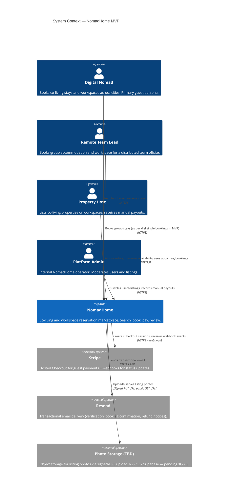
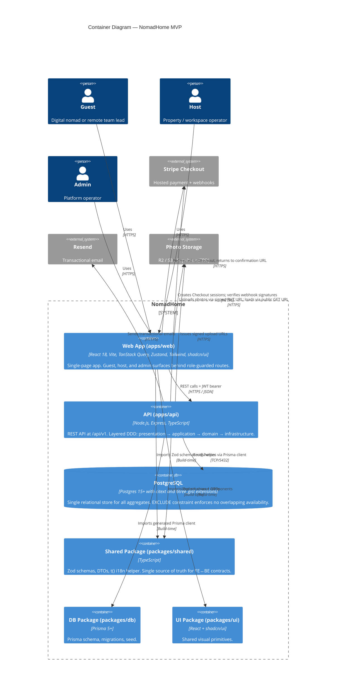
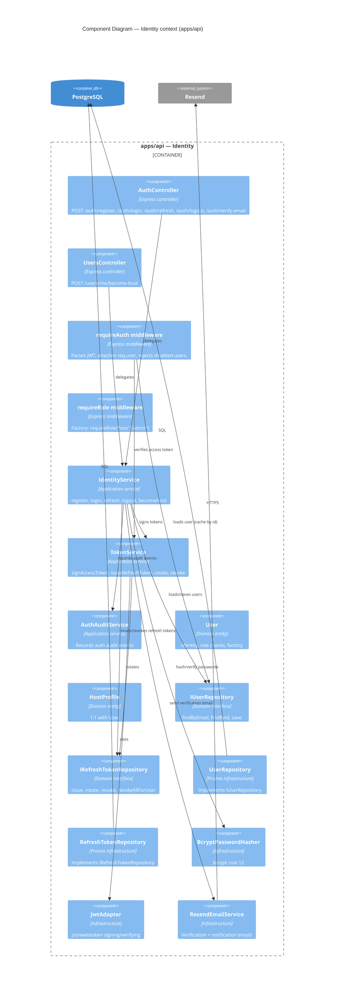
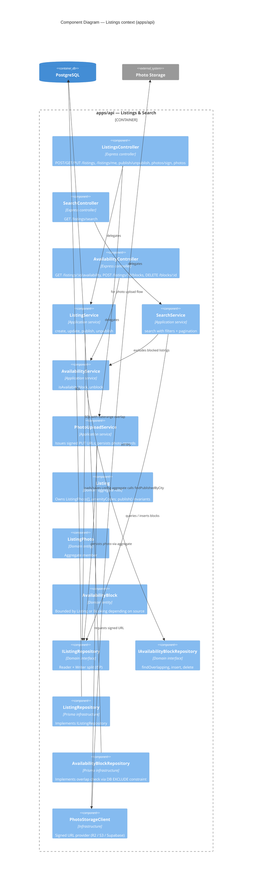
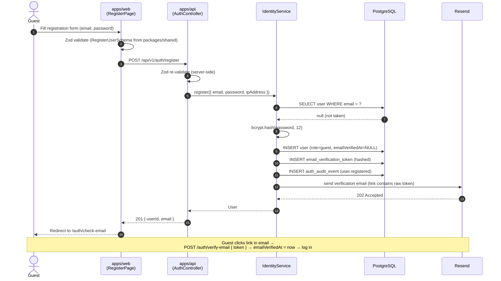
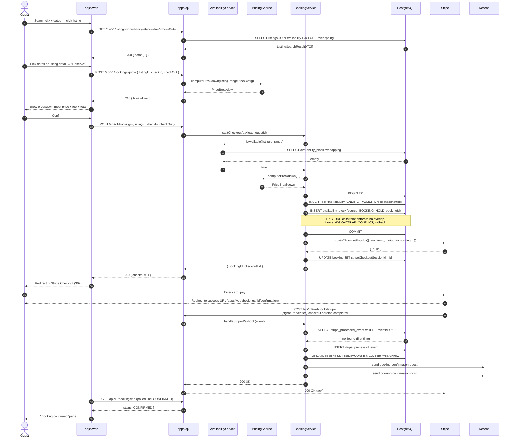
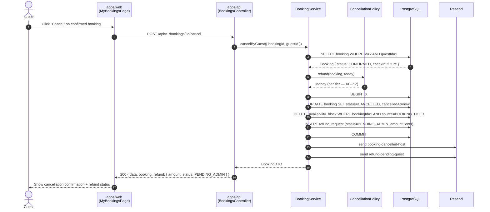

# NomadHome — Architecture Diagrams (C4)

> **Status**: Draft v0.1
> **Last updated**: 2026-05-27
> **Model**: [C4 model](https://c4model.com/) by Simon Brown — Context, Containers, Components, plus Dynamic and Deployment views.
> **Notation**: Mermaid (`C4Context`, `C4Container`, `C4Component`, `C4Deployment`, `sequenceDiagram`). Renders on GitHub, GitLab, VS Code (with the Mermaid extension), and Obsidian.
> **Sources**: [docs/PRD.md](PRD.md), [docs/data-model.md](data-model.md), [docs/tasks.md](tasks.md), [CLAUDE.md](../CLAUDE.md) §3.
> **Scope**: MVP only. Post-MVP capabilities (messaging, mobile apps, community, calendar sync, automated payouts) are not modeled here.

---

## Table of Contents

1. [How to read this document](#1-how-to-read-this-document)
2. [Level 1 — System Context](#2-level-1--system-context)
3. [Level 2 — Containers](#3-level-2--containers)
4. [Level 3 — Components](#4-level-3--components)
   - 4.1 Identity context
   - 4.2 Listings context
   - 4.3 Booking & Payments context
   - 4.4 Trust context (Reviews + Admin)
5. [Dynamic views](#5-dynamic-views)
   - 5.1 Guest registration
   - 5.2 Booking happy path (search → pay → confirm)
   - 5.3 Guest cancellation
   - 5.4 Admin disables a host (cascade)
6. [Deployment view (informal)](#6-deployment-view-informal)
7. [Legend](#7-legend)

---

## 1. How to read this document

The C4 model is a way to describe and communicate software architecture using a hierarchy of zoom levels:

- **Level 1 — Context**: NomadHome as a single box and everything it touches (users, external systems). Audience: anyone.
- **Level 2 — Containers**: the deployable/runnable units that make up NomadHome (web app, API, database, third-party services). Audience: engineers and technical stakeholders.
- **Level 3 — Components**: the major logical building blocks *inside* a container. We zoom into the API container, one bounded context at a time.
- **Level 4 — Code**: class diagrams. Omitted — TypeScript types and the entity tables in [docs/data-model.md](data-model.md) §3 cover this level.

In addition, two supplementary views:

- **Dynamic views** (§5): sequence diagrams showing how containers/components collaborate during specific user stories.
- **Deployment view** (§6): an informal sketch of where things run. Deployment topology is intentionally not locked in CLAUDE.md, so this is a starting point, not a contract.

---

## 2. Level 1 — System Context

The four personas from [docs/PRD.md](PRD.md) §5 interact with NomadHome, which depends on three external services: Stripe (payments), Resend (transactional email), and a photo storage provider (TBD — XC-7.3 in [docs/tasks.md](tasks.md)).



**Notes**:
- The `teamLead` persona books via the same surface as `nomad` in MVP — group bookings as a first-class object are Post-MVP ([docs/PRD.md](PRD.md) §5.2).
- The `admin` persona uses the same `apps/web/` UI as guests/hosts, behind role-guarded routes ([docs/PRD.md](PRD.md) §10).

---

## 3. Level 2 — Containers

Inside the NomadHome system boundary live four runtime containers plus three shared packages that exist at build time (not deployed independently but worth showing because they're the contract surface between the runtime containers).



**Why these containers?**

| Container | Why a separate container? |
| --------- | -------------------------- |
| `apps/web` | Browser runtime; independent build and deploy lifecycle from the API. Carries no secrets. |
| `apps/api` | Long-lived Node.js process; holds all secrets (Stripe, JWT, DB, Resend). Single source of business rules. |
| `PostgreSQL` | Stateful, separate operational lifecycle. Backups, migrations, scaling decisions are independent. |
| `packages/shared` | Build-time contract bridge. Lives in the repo, not deployed standalone, but it's the only way Zod schemas stay in sync between FE and BE — so it deserves to be visible. |
| `packages/db` | Same reasoning — generated Prisma client is the typed gateway to the DB. |
| `packages/ui` | Visual primitives shared between guest, host, and admin surfaces of `apps/web`. |

**Out of MVP** (would each become their own container if promoted):
- Mobile app (PWA / native)
- Worker / job runner for async tasks (currently inline in the API request cycle)
- Admin app (`apps/admin`) — deferred per CLAUDE.md §3; admin lives behind role-guarded routes in `apps/web` for MVP

---

## 4. Level 3 — Components

We zoom into `apps/api` because that's where MVP business logic lives. The API is organized by **bounded context** (identity, listings, booking & payments, trust). Each context contains components in the four DDD layers from [docs/backend-standards.md](backend-standards.md): **Presentation → Application → Domain → Infrastructure**.

> All four context diagrams below share the same conventions:
> - Green = Presentation (controllers, routes)
> - Blue = Application (services, orchestrators)
> - Orange = Domain (entities, repository interfaces, domain services)
> - Grey = Infrastructure (Prisma repositories, third-party clients)

### 4.1 Identity context

Covers [docs/PRD.md](PRD.md) US-1.1 through US-1.3 and the auth-related cross-cutting middleware.



### 4.2 Listings context

Covers US-2.1, US-2.2, US-2.3, plus search (US-3.1, US-3.2).



### 4.3 Booking & Payments context

Covers US-4.1, US-4.2, US-5.1, US-5.2. This is the most coupled context — pricing, holds, Stripe webhook, refund requests, payouts.

```mermaid
C4Component
    title Component Diagram — Booking & Payments context (apps/api)

    Container_Boundary(api, "apps/api — Booking & Payments") {
        Component(bookingsController, "BookingsController", "Express controller", "POST /bookings/quote, POST /bookings, GET /bookings/:id, GET /bookings/me, POST /bookings/:id/cancel")
        Component(webhookController, "StripeWebhookController", "Express controller", "POST /webhooks/stripe (signature-verified, public)")
        Component(adminPayoutsController, "AdminPayoutsController", "Express controller", "GET /admin/payouts/owed, POST /admin/payouts, GET /admin/payouts")

        Component(bookingSvc, "BookingService", "Application service", "startCheckout, handleStripeWebhook, cancelByGuest")
        Component(pricingSvc, "PricingService", "Domain service", "computeBreakdown(Listing, DateRange, FeeConfig)")
        Component(payoutSvc, "PayoutService", "Application service", "computeOwedByHost, recordPayout")

        Component(bookingEntity, "Booking", "Domain aggregate root", "confirm, cancel, complete; fee snapshot invariants")
        Component(payoutEntity, "Payout", "Domain aggregate root", "Owns PayoutBooking[]")
        Component(bookingRepoIface, "IBookingRepository", "Domain interface", "findById, save, listForGuest, listUpcomingForHost")
        Component(payoutRepoIface, "IPayoutRepository", "Domain interface", "save, listByHost, recordSettlement")
        Component(feeConfigRepoIface, "IPlatformFeeConfigRepository", "Domain interface", "currentConfig")

        Component(bookingRepoImpl, "BookingRepository", "Prisma infrastructure", "Implements IBookingRepository; atomic booking + hold transaction")
        Component(payoutRepoImpl, "PayoutRepository", "Prisma infrastructure", "Implements IPayoutRepository; enforces PayoutBooking.bookingId UNIQUE")
        Component(stripeClient, "StripeClient", "Infrastructure", "createCheckoutSession, verifyWebhookSignature")
        Component(stripeIdempotency, "StripeProcessedEventStore", "Infrastructure", "Dedupes webhook events by eventId")
        Component(emailClient2, "EmailService", "Infrastructure", "Booking confirmation, cancellation, refund-pending emails")
    }

    ContainerDb(db, "PostgreSQL", "")
    System_Ext(stripe, "Stripe", "")
    System_Ext(resend, "Resend", "")

    Component_Ext(availabilitySvc, "AvailabilityService", "(from Listings context — §4.2)")

    Rel(bookingsController, bookingSvc, "delegates")
    Rel(bookingsController, pricingSvc, "for /quote endpoint")
    Rel(webhookController, bookingSvc, "delivers verified events")
    Rel(adminPayoutsController, payoutSvc, "delegates")

    Rel(bookingSvc, availabilitySvc, "isAvailable before checkout")
    Rel(bookingSvc, pricingSvc, "snapshots fees at booking time")
    Rel(bookingSvc, bookingRepoIface, "saves Booking + hold atomically")
    Rel(bookingSvc, stripeClient, "creates Checkout session")
    Rel(bookingSvc, stripeIdempotency, "dedupes webhook events")
    Rel(bookingSvc, emailClient2, "sends confirmation/cancellation emails")

    Rel(pricingSvc, feeConfigRepoIface, "loads current fee config")

    Rel(payoutSvc, payoutRepoIface, "computes/records payouts")
    Rel(payoutSvc, bookingRepoIface, "reads completed bookings")

    Rel(stripeClient, stripe, "HTTPS")
    Rel(webhookController, stripeClient, "verifies signature")
    Rel(bookingRepoImpl, db, "SQL")
    Rel(payoutRepoImpl, db, "SQL")
    Rel(stripeIdempotency, db, "SQL")
    Rel(emailClient2, resend, "HTTPS")
```



### 4.4 Trust context (Reviews + Admin moderation)

Covers US-6.1, US-7.1, US-8.1, US-8.2.

```mermaid
C4Component
    title Component Diagram — Trust context (apps/api)

    Container_Boundary(api, "apps/api — Trust") {
        Component(reviewsController, "ReviewsController", "Express controller", "POST /bookings/:id/review, GET /listings/:id/reviews")
        Component(hostController, "HostController", "Express controller", "GET /host/bookings/upcoming, GET /host/bookings/:id")
        Component(adminUsersController, "AdminUsersController", "Express controller", "GET/POST /admin/users (search, disable, enable)")
        Component(adminListingsController, "AdminListingsController", "Express controller", "GET/POST /admin/listings (search, disable, enable)")

        Component(reviewSvc, "ReviewService", "Application service", "create (with rating recompute in same tx)")
        Component(hostBookingSvc, "HostBookingService", "Application service", "listUpcomingForHost, getDetail (PII-minimized)")
        Component(adminSvc, "AdminService", "Application service", "disableUser, enableUser, disableListing, enableListing (cascades)")

        Component(reviewEntity, "Review", "Domain entity", "rating 1..5, one per booking (UNIQUE)")
        Component(flagEntity, "BookingFlag", "Domain entity", "Cascade-side-effect audit row")

        Component(reviewRepoIface, "IReviewRepository", "Domain interface", "save, findForListing")
        Component(listingRatingUpdater, "IListingRatingUpdater", "Domain interface", "recomputeAverageRating (from Listings context, ISP slice)")
        Component(flagRepoIface, "IBookingFlagRepository", "Domain interface", "insert, listForBooking")

        Component(reviewRepoImpl, "ReviewRepository", "Prisma infrastructure", "Implements IReviewRepository")
        Component(flagRepoImpl, "BookingFlagRepository", "Prisma infrastructure", "Implements IBookingFlagRepository")
    }

    ContainerDb(db, "PostgreSQL", "")
    Component_Ext(userRepoIface, "IUserRepository", "(from Identity context — §4.1)")
    Component_Ext(listingRepoIface2, "IListingRepository", "(from Listings context — §4.2)")
    Component_Ext(bookingRepoIface2, "IBookingRepository", "(from Booking context — §4.3)")
    Component_Ext(refreshRepoIface2, "IRefreshTokenRepository", "(from Identity context — §4.1)")

    Rel(reviewsController, reviewSvc, "delegates")
    Rel(hostController, hostBookingSvc, "delegates")
    Rel(adminUsersController, adminSvc, "delegates")
    Rel(adminListingsController, adminSvc, "delegates")

    Rel(reviewSvc, reviewRepoIface, "saves review")
    Rel(reviewSvc, listingRatingUpdater, "recomputes rating in same tx")
    Rel(reviewSvc, bookingRepoIface2, "validates booking eligibility")

    Rel(hostBookingSvc, bookingRepoIface2, "queries host's bookings")

    Rel(adminSvc, userRepoIface, "sets disabledAt")
    Rel(adminSvc, listingRepoIface2, "disables host's listings on cascade")
    Rel(adminSvc, bookingRepoIface2, "finds bookings to flag")
    Rel(adminSvc, flagRepoIface, "inserts BookingFlag rows")
    Rel(adminSvc, refreshRepoIface2, "revokes all refresh tokens for disabled user")

    Rel(reviewRepoImpl, db, "SQL")
    Rel(flagRepoImpl, db, "SQL")
```



---

## 5. Dynamic views

Sequence diagrams for the most important MVP flows. Boxes group columns by container; participants inside `apps/api` are components from §4.

### 5.1 Guest registration

Maps to US-1.1.



### 5.2 Booking happy path (search → pay → confirm)

Maps to US-3.1, US-4.1, US-5.1. This is the canonical end-to-end flow that the MVP must prove works.



### 5.3 Guest cancellation

Maps to US-4.2.



### 5.4 Admin disables a host (cascade)

Maps to US-8.1. Demonstrates the cross-aggregate transaction described in [docs/data-model.md](data-model.md) §7 invariant #4.

```mermaid
sequenceDiagram
    autonumber
    actor Admin
    participant Web as apps/web<br/>(AdminUsersPage)
    participant API as apps/api<br/>(AdminUsersController)
    participant AdminSvc as AdminService
    participant DB as PostgreSQL
    participant Email as Resend

    Admin->>Web: Click "Disable" on a host
    Web->>API: POST /api/v1/admin/users/:id/disable
    API->>AdminSvc: disableUser({ adminId, userId, reason })

    AdminSvc->>DB: BEGIN TX
    AdminSvc->>DB: UPDATE user SET disabledAt = now()
    AdminSvc->>DB: UPDATE listing SET status=DISABLED, disabledAt=now() WHERE hostId=?
    AdminSvc->>DB: SELECT booking WHERE (guestId=? OR hostId=?) AND status=CONFIRMED AND checkIn >= today
    DB-->>AdminSvc: Booking[]
    loop for each affected booking
        AdminSvc->>DB: INSERT booking_flag (reason=HOST_DISABLED, flaggedByAdminId)
    end
    AdminSvc->>DB: UPDATE refresh_token SET revokedAt = now() WHERE userId=?
    AdminSvc->>DB: INSERT auth_audit_event (event=user_disabled)
    AdminSvc->>DB: COMMIT

    loop for each affected booking
        AdminSvc->>Email: send listing-disabled-notice to counterparty
    end

    AdminSvc-->>API: 204 No Content
    API-->>Web: 204
    Web-->>Admin: User row shows "Disabled" badge

    Note over API,DB: Existing access tokens still work until their<br/>15-min TTL expires; refresh attempts return 401<br/>(no enumeration) because refresh tokens are revoked.
```

---

## 6. Deployment view (informal)

CLAUDE.md §3 deliberately does not lock the deployment topology — that's an ADR decision when it comes time. This diagram sketches a reasonable starting topology so the conversation has a baseline.

```mermaid
C4Deployment
    title Deployment View — NomadHome MVP (illustrative)

    Deployment_Node(browser, "User's Browser", "Chrome / Safari / Firefox") {
        Container(webRuntime, "apps/web", "React SPA bundle served from CDN")
    }

    Deployment_Node(cdn, "CDN / Static Hosting", "Cloudflare Pages / Vercel / Netlify") {
        Container(webBuild, "apps/web build artifacts", "Static HTML/CSS/JS")
    }

    Deployment_Node(apiHost, "API Host", "Containerized Node.js (Fly.io / Render / Railway / ECS)") {
        Container(apiRuntime, "apps/api", "Node.js + Express, long-lived process")
    }

    Deployment_Node(dbHost, "Managed Postgres", "Neon / Supabase / RDS") {
        ContainerDb(pg, "PostgreSQL 15+", "citext, btree_gist extensions enabled; daily backups")
    }

    System_Ext(stripeProd, "Stripe (managed)", "")
    System_Ext(resendProd, "Resend (managed)", "")
    System_Ext(storageProd, "Photo Storage (managed)", "Cloudflare R2 / AWS S3 / Supabase Storage")

    Rel(webRuntime, cdn, "Loads bundle from", "HTTPS")
    Rel(webRuntime, apiRuntime, "REST", "HTTPS")
    Rel(webRuntime, storageProd, "Photo PUT/GET", "HTTPS")
    Rel(webRuntime, stripeProd, "Stripe Checkout redirect", "HTTPS")

    Rel(apiRuntime, pg, "TCP/5432 with TLS", "Connection pool")
    Rel(apiRuntime, stripeProd, "API + webhook", "HTTPS")
    Rel(apiRuntime, resendProd, "Transactional email", "HTTPS")
    Rel(apiRuntime, storageProd, "Signed URL issuance", "HTTPS")
```

**Open infrastructure questions** (none block MVP coding; all worth deciding before production):

- API hosting choice (Fly.io is the lowest-friction first pick; AWS ECS is heavier but most flexible).
- Static hosting choice for `apps/web` (Cloudflare Pages is the cheapest and fastest globally).
- Managed Postgres provider (Neon's branching is great for ephemeral preview environments; Supabase bundles auth + storage we don't need).
- Photo storage provider (XC-7.3 in [docs/tasks.md](tasks.md)).
- Stripe webhook receiving requires a public HTTPS endpoint — confirm the API host supports stable URLs (not Lambda cold-starts that miss webhook retries).

---

## 7. Legend

### C4 element types

| Symbol (Mermaid) | Meaning |
| ---------------- | ------- |
| `Person(...)` | A human user / role (persona from [docs/PRD.md](PRD.md) §5) |
| `System(...)` | A software system inside the scope of NomadHome |
| `System_Ext(...)` | An external software system NomadHome depends on |
| `Container(...)` | A deployable/runnable unit (web app, API, database) or build-time package |
| `ContainerDb(...)` | A data store |
| `Component(...)` | A logical building block inside a container (a service, a controller, a repository) |
| `Component_Ext(...)` | A component owned by another bounded context, referenced from this diagram |
| `Rel(a, b, "...")` | A directed dependency / interaction |
| `Deployment_Node(...)` | A physical/virtual host or environment (browser, VM, managed service) |

### Layer color coding (used informally in §4)

- 🟩 **Green** — Presentation (controllers, routes, middleware)
- 🟦 **Blue** — Application (services, orchestrators, domain services)
- 🟧 **Orange** — Domain (entities, value objects, repository interfaces)
- ⬜ **Grey** — Infrastructure (Prisma repositories, Stripe/Resend/storage clients)

Color is conveyed by the C4 component category in the Mermaid source rather than literal CSS — most renderers will assign distinct shapes/borders rather than fills.

### Cross-references

- Entities and tables → [docs/data-model.md](data-model.md)
- Implementation tasks per component → [docs/tasks.md](tasks.md)
- User stories driving each flow → [docs/PRD.md](PRD.md) §8
- Layered architecture rules → [docs/backend-standards.md](backend-standards.md) §Architecture Overview
- Frontend state separation referenced in §3 → [docs/frontend-standards.md](frontend-standards.md) §State Separation Philosophy

---

# End of architecture-diagram.md
