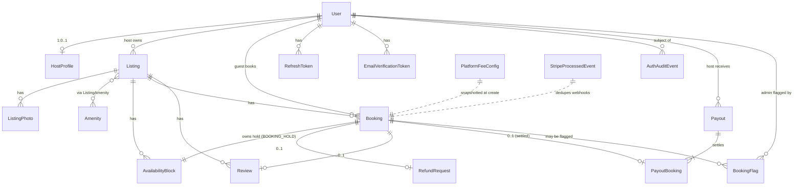

# NomadHome — Data Model (MVP)

> **Status**: Draft v0.1
> **Last updated**: 2026-05-27
> **Sources**: [docs/PRD.md](PRD.md) §8 (user stories) and [docs/tasks.md](tasks.md) (per-story DB tasks).
> **Authority**: This document is the canonical reference for the MVP data model. The runtime source of truth is [`packages/db/prisma/schema.prisma`](../packages/db/prisma/schema.prisma); when this document and the schema disagree, the schema wins and this document must be updated in the same OpenSpec change.
> **Scope**: MVP only. Post-MVP entities (messaging, community, calendar sync, etc.) are listed in §10 as deferred, not as part of the model.

---

## 1. Overview

The MVP data model is organized around four bounded contexts, each owning a small cluster of aggregates:

| Context | Aggregates | Purpose |
| ------- | ---------- | ------- |
| **Identity** | `User`, `HostProfile`, `RefreshToken`, `EmailVerificationToken`, `AuthAuditEvent` | Authentication, authorization, audit |
| **Listings** | `Listing` (root, with `ListingPhoto` + `ListingAmenity`), `Amenity`, `AvailabilityBlock` | Inventory and availability |
| **Booking & Payments** | `Booking`, `PlatformFeeConfig`, `StripeProcessedEvent`, `RefundRequest`, `Payout` (with `PayoutBooking`) | End-to-end reservation, money flow |
| **Trust** | `Review`, `BookingFlag` | Reviews, admin moderation cascades |

All identifiers are UUIDs (`@default(uuid())`). All monetary amounts are stored as **integer cents** (`amountCents: Int`) with an explicit `currency` column (ISO 4217). All timestamps are `DateTime` (Postgres `timestamptz`). Fee percentages are stored as **basis points** (`bps`, where 100 bps = 1%).

---

## 2. Entity-Relationship Diagram



> Diamond cardinality reminder: `||` = exactly one, `o|` = zero or one, `o{` = zero or more, `|{` = one or more.

---

## 3. Aggregates and Entities

For each aggregate root the table below lists every column with type, constraints, and intent. Composite indexes are listed in §6.

### 3.1 `User` (Identity aggregate root)

Authoritative account record. Roles are kept as a `String[]` array so a single account can hold multiple roles (e.g., `["guest", "host"]`) — see [docs/PRD.md](PRD.md) §5.

| Column | Type | Constraints | Notes |
| ------ | ---- | ----------- | ----- |
| `id` | `uuid` | PK | |
| `email` | `citext` | UNIQUE, NOT NULL | Case-insensitive; Postgres `citext` extension required |
| `passwordHash` | `string` | NOT NULL | bcrypt cost ≥12 |
| `roles` | `string[]` | NOT NULL, default `["guest"]` | Subset of `{guest, host, admin}` |
| `emailVerifiedAt` | `DateTime?` | nullable | NULL until `/auth/verify-email` consumed |
| `disabledAt` | `DateTime?` | nullable | Set by US-8.1; rejected by `requireAuth` |
| `createdAt` | `DateTime` | NOT NULL, default `now()` | |
| `updatedAt` | `DateTime` | NOT NULL, `@updatedAt` | |

**Invariants:**
- A user with `disabledAt != null` cannot log in (enforced in `requireAuth` middleware; refresh tokens are revoked at disable time).
- Booking/listing actions require `emailVerifiedAt != null` (browsing does not).

### 3.2 `HostProfile`

1:1 with `User`. Created lazily when a user calls `POST /users/me/become-host` (US-1.3).

| Column | Type | Constraints | Notes |
| ------ | ---- | ----------- | ----- |
| `userId` | `uuid` | PK + FK → `User.id` UNIQUE | |
| `displayName` | `string` | NOT NULL, min length 2 | |
| `phone` | `string` | NOT NULL | E.164 validated at app layer |
| `payoutEmail` | `string` | NOT NULL | Resend-format email |
| `acceptedTermsVersion` | `string` | NOT NULL | Frozen at onboarding time |
| `createdAt` | `DateTime` | NOT NULL, default `now()` | |

### 3.3 `RefreshToken`

Server-side revocable refresh token (PRD §10). Rotation/TTL policy per `openspec/specs/identity/spec.md` requirement "Access tokens and refresh tokens": **30-day absolute TTL from issuance, sliding rotation on use, reuse detection via full revocation, per-token logout** (rationale in the archived `decide-refresh-token-policy` ADR).

| Column | Type | Constraints | Notes |
| ------ | ---- | ----------- | ----- |
| `id` | `uuid` | PK | |
| `userId` | `uuid` | FK → `User.id`, ON DELETE CASCADE | |
| `tokenHash` | `string` | NOT NULL, UNIQUE | Store hash, never raw token |
| `expiresAt` | `DateTime` | NOT NULL | `issuedAt + JWT_REFRESH_TTL` where `JWT_REFRESH_TTL = 30d`; never updated after insert (rotation creates a new row, it does not extend an existing TTL) |
| `revokedAt` | `DateTime?` | nullable | Set on logout, rotation, user disable, or reuse-detection cascade |
| `createdAt` | `DateTime` | NOT NULL, default `now()` | `issuedAt` for TTL purposes |
| `lastUsedAt` | `DateTime?` | nullable | Updated on each successful refresh-endpoint call (before the row is marked revoked) for forensic context |
| `userAgent` | `string?` | nullable | Captured at issue for forensic context |

**Invariants** (enforced by `AuthService`):

1. The refresh endpoint inserts a new `RefreshToken` row AND sets `revokedAt` on the presented row in a single transaction.
2. When a row with `revokedAt IS NOT NULL` is presented to the refresh endpoint, every row matching `userId = <user> AND revokedAt IS NULL` is updated to set `revokedAt = now()` in a single transaction. An audit log entry `user.refresh_token_reuse_detected` is appended.
3. Logout sets `revokedAt` on the presented row only; other rows for the same `userId` are not touched.
4. A periodic prune job (out of scope for the policy ADR, tracked as a follow-up) hard-deletes rows where `revokedAt < now() - 90 days`. This bounds table growth without losing forensic data for recent incidents.

### 3.4 `EmailVerificationToken`

Single-use token issued at registration.

| Column | Type | Constraints | Notes |
| ------ | ---- | ----------- | ----- |
| `id` | `uuid` | PK | |
| `userId` | `uuid` | FK → `User.id`, ON DELETE CASCADE | |
| `tokenHash` | `string` | NOT NULL, UNIQUE | |
| `expiresAt` | `DateTime` | NOT NULL | 24h default |
| `usedAt` | `DateTime?` | nullable | Set when consumed; rejects replay |

### 3.5 `AuthAuditEvent`

Append-only log driving the basic audit trail required by PRD §10 compliance.

| Column | Type | Constraints | Notes |
| ------ | ---- | ----------- | ----- |
| `id` | `uuid` | PK | |
| `userId` | `uuid?` | FK → `User.id`, nullable | Null for failed logins where email is unknown |
| `event` | `enum AuthAuditEventType` | NOT NULL | See §5 |
| `ipAddress` | `string` | NOT NULL | |
| `userAgent` | `string?` | nullable | |
| `metadata` | `json?` | nullable | E.g., role added, reason for disable |
| `createdAt` | `DateTime` | NOT NULL, default `now()` | |

### 3.6 `Listing` (Listings aggregate root)

The aggregate root for inventory. Contains `ListingPhoto` and `ListingAmenity` as part of the aggregate; modifications must go through the root in the application layer.

| Column | Type | Constraints | Notes |
| ------ | ---- | ----------- | ----- |
| `id` | `uuid` | PK | |
| `hostId` | `uuid` | FK → `User.id` | Host owner |
| `title` | `string` | NOT NULL | |
| `description` | `text` | NOT NULL | |
| `type` | `enum ListingType` | NOT NULL | `PROPERTY` or `WORKSPACE` |
| `city` | `string` | NOT NULL | |
| `country` | `string` | NOT NULL | ISO 3166-1 alpha-2 |
| `addressLine` | `string` | NOT NULL | |
| `latitude` | `Decimal?` | nullable, precision 9, scale 6 | |
| `longitude` | `Decimal?` | nullable, precision 9, scale 6 | |
| `capacity` | `int` | NOT NULL, ≥1 | |
| `nightlyRateCents` | `int` | NOT NULL, >0 | |
| `currency` | `string` | NOT NULL, default `"USD"` | ISO 4217 |
| `status` | `enum ListingStatus` | NOT NULL, default `DRAFT` | |
| `averageRating` | `Decimal?` | nullable, precision 3, scale 2 | Denormalized (US-6.1) |
| `reviewCount` | `int` | NOT NULL, default 0 | Denormalized |
| `disabledAt` | `DateTime?` | nullable | Set by US-8.2 |
| `createdAt` | `DateTime` | NOT NULL, default `now()` | |
| `updatedAt` | `DateTime` | NOT NULL, `@updatedAt` | |

**Invariants (enforced in `Listing.publish()` domain method, [docs/tasks.md](tasks.md) 2.1.9):**
- Cannot transition to `PUBLISHED` without ≥1 `ListingPhoto`, ≥1 `ListingAmenity`, and `nightlyRateCents > 0`.
- `disabledAt` is set only by admin (`AdminService.disableListing`); re-enabling reverts to `DRAFT`, not `PUBLISHED`.

### 3.7 `ListingPhoto`

| Column | Type | Constraints | Notes |
| ------ | ---- | ----------- | ----- |
| `id` | `uuid` | PK | |
| `listingId` | `uuid` | FK → `Listing.id`, ON DELETE CASCADE | |
| `url` | `string` | NOT NULL | Stored URL from signed-upload flow (XC-7.3) |
| `position` | `int` | NOT NULL | UNIQUE per listing |
| `createdAt` | `DateTime` | NOT NULL, default `now()` | |

Composite UNIQUE `(listingId, position)`.

### 3.8 `Amenity` (lookup)

| Column | Type | Constraints | Notes |
| ------ | ---- | ----------- | ----- |
| `code` | `string` | PK | E.g., `wifi`, `kitchen`, `workspace_desk` |
| `label` | `string` | NOT NULL | English display label |

Seeded by [`packages/db/seed.ts`](../packages/db/seed.ts) with the list in [docs/tasks.md](tasks.md) 2.1.3.

### 3.9 `ListingAmenity` (join)

| Column | Type | Constraints | Notes |
| ------ | ---- | ----------- | ----- |
| `listingId` | `uuid` | FK → `Listing.id`, ON DELETE CASCADE | |
| `amenityCode` | `string` | FK → `Amenity.code` | |

Composite PK `(listingId, amenityCode)`.

### 3.10 `AvailabilityBlock`

Date-range row blocking a listing. Three sources, distinguished by `source`:

| Column | Type | Constraints | Notes |
| ------ | ---- | ----------- | ----- |
| `id` | `uuid` | PK | |
| `listingId` | `uuid` | FK → `Listing.id`, ON DELETE CASCADE | |
| `startDate` | `Date` | NOT NULL | Inclusive |
| `endDate` | `Date` | NOT NULL | Exclusive |
| `source` | `enum AvailabilityBlockSource` | NOT NULL | `HOST_BLOCK`, `BOOKING_HOLD`, `ADMIN_BLOCK` |
| `bookingId` | `uuid?` | FK → `Booking.id`, nullable | NOT NULL when `source = BOOKING_HOLD` |
| `createdAt` | `DateTime` | NOT NULL, default `now()` | |

**Overlap exclusion (Postgres-specific):** add a manual SQL step in the migration:

```sql
ALTER TABLE "AvailabilityBlock"
  ADD CONSTRAINT availability_no_overlap
  EXCLUDE USING gist (
    "listingId" WITH =,
    daterange("startDate", "endDate", '[)') WITH &&
  );
```

This guarantees the marketplace cannot double-book at the DB level even under race conditions (per [docs/tasks.md](tasks.md) 2.3.2 and 4.1.18 — the loser of a race gets `409 OVERLAP_CONFLICT`).

#### Overlap-conflict semantics

The EXCLUDE constraint rejects every overlap at the DB layer with Postgres error `23P01`. The application layer MUST translate that into a structured `409 OVERLAP_CONFLICT` response whose body identifies the conflicting block so the caller can act on it:

```json
{
  "error": "OVERLAP_CONFLICT",
  "conflict": {
    "blockId": "<uuid of the existing AvailabilityBlock>",
    "source": "HOST_BLOCK | BOOKING_HOLD | ADMIN_BLOCK",
    "startDate": "<inclusive>",
    "endDate": "<exclusive>",
    "bookingId": "<uuid, present only when source = BOOKING_HOLD>"
  }
}
```

The `bookingId` field MUST be returned when the existing block has `source = BOOKING_HOLD`, so a host who hits a conflict can contact the affected guest (resolves Finding 6 of `docs/adversarial-review.md`).

**Matrix — host-initiated block (the only block-creation flow in MVP):**

| Existing block | New block | Result | Notes |
| --- | --- | --- | --- |
| (no existing block on the range) | `HOST_BLOCK` | 201 created | normal path of US-2.3 |
| `HOST_BLOCK` | `HOST_BLOCK` | 409 `OVERLAP_CONFLICT` | host attempting to re-block their own range — caller-side coalescing is the host's responsibility |
| `BOOKING_HOLD` (`Booking.status = PENDING_PAYMENT`) | `HOST_BLOCK` | 409 `OVERLAP_CONFLICT` | a guest's checkout is in progress; the response includes `bookingId` so the host can contact the guest or wait for the 30-minute hold sweeper ([§7](#7-cross-cutting-invariants) invariant 8) |
| `BOOKING_HOLD` (`Booking.status = CONFIRMED`) | `HOST_BLOCK` | 409 `OVERLAP_CONFLICT` | confirmed booking — the response includes `bookingId`; the host's remedy is to coordinate cancellation/refund with the guest |
| `ADMIN_BLOCK` | `HOST_BLOCK` | 409 `OVERLAP_CONFLICT` | host cannot override an admin block; remedy is to contact an admin |

The matrix intentionally only covers `HOST_BLOCK` as the new-block source. `BOOKING_HOLD` insertion is covered by the atomic-booking-creation invariant ([§7](#7-cross-cutting-invariants) invariant 1) and the race-loser scenario in `openspec/specs/booking/spec.md`. `ADMIN_BLOCK` insertion is **out of MVP** — admin moderation tooling beyond enable/disable is deferred ([openspec/project.md](../openspec/project.md) §3.1 row "Admin"), so the enum value exists for forward compatibility but no user story currently produces an `ADMIN_BLOCK` row.

### 3.11 `Booking` (Booking aggregate root)

Snapshot-heavy: prices and fees are frozen at booking time so subsequent config changes never retroactively alter financials (PRD §7 invariant).

| Column | Type | Constraints | Notes |
| ------ | ---- | ----------- | ----- |
| `id` | `uuid` | PK | |
| `listingId` | `uuid` | FK → `Listing.id` | |
| `guestId` | `uuid` | FK → `User.id` | |
| `hostId` | `uuid` | FK → `User.id` | Denormalized for host-side queries |
| `checkIn` | `Date` | NOT NULL | Inclusive |
| `checkOut` | `Date` | NOT NULL | Exclusive, > `checkIn` |
| `nights` | `int` | NOT NULL, ≥1 | Computed and snapshotted |
| `nightlyRateCents` | `int` | NOT NULL | Snapshot of `Listing.nightlyRateCents` |
| `subtotalCents` | `int` | NOT NULL | = `nightlyRateCents * nights` |
| `guestServiceFeeBps` | `int` | NOT NULL | Snapshot from `PlatformFeeConfig` |
| `guestServiceFeeCents` | `int` | NOT NULL | |
| `hostCommissionBps` | `int` | NOT NULL | Snapshot from `PlatformFeeConfig` |
| `hostCommissionCents` | `int` | NOT NULL | |
| `currency` | `string` | NOT NULL | ISO 4217 |
| `totalChargedCents` | `int` | NOT NULL | = `subtotalCents + guestServiceFeeCents` |
| `payoutCents` | `int` | NOT NULL | = `subtotalCents - hostCommissionCents` |
| `status` | `enum BookingStatus` | NOT NULL, default `PENDING_PAYMENT` | |
| `stripeCheckoutSessionId` | `string?` | nullable | Set when checkout starts |
| `stripePaymentIntentId` | `string?` | nullable | Captured from webhook |
| `confirmedAt` | `DateTime?` | nullable | Set on `checkout.session.completed` |
| `cancelledAt` | `DateTime?` | nullable | Set on guest cancel or session expiry |
| `cancellationReason` | `string?` | nullable | |
| `createdAt` | `DateTime` | NOT NULL, default `now()` | |

**Lifecycle:**

```
PENDING_PAYMENT ──(checkout.session.completed)──▶ CONFIRMED ──(checkOut <= today + nightly job)──▶ COMPLETED
       │                                              │
       │                                              ├─(guest cancels before check-in)──▶ CANCELLED
       │
       └─(checkout.session.expired or guest abandons)─▶ CANCELLED
```

**Invariants:**
- A `BOOKING_HOLD` row in `AvailabilityBlock` exists iff `Booking.status IN (PENDING_PAYMENT, CONFIRMED)`. Transitioning to `CANCELLED` deletes the hold; transitioning to `COMPLETED` keeps the hold (historical record).
- Fee snapshot columns are immutable after creation (enforced by domain entity; no UPDATE path mutates them).

### 3.12 `PlatformFeeConfig`

Single live config row; historical rows allowed for auditability of past changes.

| Column | Type | Constraints | Notes |
| ------ | ---- | ----------- | ----- |
| `id` | `uuid` | PK | |
| `guestServiceFeeBps` | `int` | NOT NULL | E.g., 1200 = 12% |
| `hostCommissionBps` | `int` | NOT NULL | E.g., 300 = 3% |
| `effectiveFrom` | `DateTime` | NOT NULL | Current row = highest `effectiveFrom <= now()` |

Lookup helper in `PricingService.currentConfig()`. Values for MVP are open (XC-7.1 in [docs/tasks.md](tasks.md)).

### 3.13 `StripeProcessedEvent`

Idempotency table for Stripe webhooks.

| Column | Type | Constraints | Notes |
| ------ | ---- | ----------- | ----- |
| `eventId` | `string` | PK | Stripe event id (`evt_...`) |
| `processedAt` | `DateTime` | NOT NULL, default `now()` | |

Webhook handler inserts before side-effects; conflict → skip.

### 3.14 `RefundRequest`

| Column | Type | Constraints | Notes |
| ------ | ---- | ----------- | ----- |
| `id` | `uuid` | PK | |
| `bookingId` | `uuid` | FK → `Booking.id`, UNIQUE | One refund per booking in MVP |
| `amountCents` | `int` | NOT NULL, ≥0 | Computed per cancellation policy (XC-7.2) |
| `status` | `enum RefundStatus` | NOT NULL, default `PENDING_ADMIN` | |
| `requestedAt` | `DateTime` | NOT NULL, default `now()` | |
| `processedAt` | `DateTime?` | nullable | |
| `notes` | `text?` | nullable | |

### 3.15 `Review`

| Column | Type | Constraints | Notes |
| ------ | ---- | ----------- | ----- |
| `id` | `uuid` | PK | |
| `bookingId` | `uuid` | FK → `Booking.id`, UNIQUE | One review per booking |
| `listingId` | `uuid` | FK → `Listing.id` | Denormalized for read-side fanout |
| `guestId` | `uuid` | FK → `User.id` | |
| `rating` | `int` | NOT NULL, 1..5 (CHECK) | |
| `body` | `text?` | nullable, max 2000 | |
| `createdAt` | `DateTime` | NOT NULL, default `now()` | |

After insert, `ReviewService` recomputes `Listing.averageRating` and `Listing.reviewCount` in the same transaction.

### 3.16 `Payout`

| Column | Type | Constraints | Notes |
| ------ | ---- | ----------- | ----- |
| `id` | `uuid` | PK | |
| `hostId` | `uuid` | FK → `User.id` | |
| `amountCents` | `int` | NOT NULL, ≥0 | = SUM of related `Booking.payoutCents` |
| `currency` | `string` | NOT NULL | |
| `paidAt` | `Date` | NOT NULL | Out-of-band transfer date |
| `method` | `string` | NOT NULL | `bank_transfer`, `wise`, `paypal`, etc. |
| `externalReference` | `string?` | nullable | Reference id from external system |
| `notes` | `text?` | nullable | |
| `recordedByAdminId` | `uuid` | FK → `User.id` | Admin who recorded the payout |
| `createdAt` | `DateTime` | NOT NULL, default `now()` | |

### 3.17 `PayoutBooking` (join)

| Column | Type | Constraints | Notes |
| ------ | ---- | ----------- | ----- |
| `payoutId` | `uuid` | FK → `Payout.id`, ON DELETE CASCADE | |
| `bookingId` | `uuid` | FK → `Booking.id`, UNIQUE | Booking can only be settled once |

Composite PK `(payoutId, bookingId)`. The `bookingId` UNIQUE is the key invariant preventing double-settlement (US-5.3).

### 3.18 `BookingFlag`

Audit row written when an admin cascade affects a booking (US-8.1, US-8.2, US-8.3). The `reason` value identifies which cascade produced the flag: `HOST_DISABLED` for the host-side path of US-8.1, `GUEST_DISABLED` for US-8.3, and `LISTING_DISABLED` for US-8.2.

| Column | Type | Constraints | Notes |
| ------ | ---- | ----------- | ----- |
| `id` | `uuid` | PK | |
| `bookingId` | `uuid` | FK → `Booking.id` | |
| `reason` | `enum BookingFlagReason` | NOT NULL | `HOST_DISABLED`, `GUEST_DISABLED`, `LISTING_DISABLED` |
| `flaggedAt` | `DateTime` | NOT NULL, default `now()` | |
| `resolvedAt` | `DateTime?` | nullable | |
| `resolutionNote` | `text?` | nullable | |
| `flaggedByAdminId` | `uuid` | FK → `User.id` | |

---

## 4. Aggregate boundaries (DDD)

Per [docs/backend-standards.md](backend-standards.md) §Aggregates, the application layer only loads/saves aggregate **roots**; nested entities/value objects are mutated through the root.

| Aggregate root | Members loaded together | Cannot be modified independently |
| -------------- | ----------------------- | -------------------------------- |
| `User` | — (refresh tokens, audit events, verification tokens are separate aggregates referenced by `userId`) | — |
| `HostProfile` | — | — (own aggregate, 1:1 with User) |
| `Listing` | `ListingPhoto[]`, `ListingAmenity[]`, current `AvailabilityBlock[]` window | `ListingPhoto`, `ListingAmenity` |
| `Booking` | — (review, refund, payout-link referenced separately) | — |
| `Payout` | `PayoutBooking[]` | `PayoutBooking` |
| `Review` | — | — |

`AvailabilityBlock` is a borderline case: rows of `source = HOST_BLOCK` belong to the `Listing` aggregate; rows of `source = BOOKING_HOLD` are owned by the `Booking` aggregate (lifecycle is tied to booking status). The repository layer enforces this: `ListingRepository.replaceHostBlocks()` only manages `HOST_BLOCK` rows, while `BookingRepository.confirm()` and `BookingRepository.cancel()` manage the `BOOKING_HOLD` row.

---

## 5. Enums

```prisma
enum AuthAuditEventType {
  registered
  login_succeeded
  login_failed
  password_reset_requested
  role_added
  user_disabled
}

enum ListingType {
  PROPERTY
  WORKSPACE
}

enum ListingStatus {
  DRAFT
  PUBLISHED
  DISABLED
}

enum AvailabilityBlockSource {
  HOST_BLOCK
  BOOKING_HOLD
  ADMIN_BLOCK
}

enum BookingStatus {
  PENDING_PAYMENT
  CONFIRMED
  CANCELLED
  COMPLETED
}

enum RefundStatus {
  PENDING_ADMIN
  PROCESSED
  REJECTED
}

enum BookingFlagReason {
  HOST_DISABLED
  GUEST_DISABLED
  LISTING_DISABLED
}
```

---

## 6. Indexes

Beyond primary keys and the implicit indexes Prisma creates on foreign keys, the following composite/secondary indexes are required to meet the NFRs in [docs/tasks.md](tasks.md):

| Table | Index | Reason |
| ----- | ----- | ------ |
| `User` | `email` (already UNIQUE) | Login lookup |
| `Listing` | `(city, status)` | Search (US-3.1) |
| `Listing` | `(hostId)` | Host dashboard (US-7.1) |
| `Listing` | `(nightlyRateCents)` | Filter (US-3.2) |
| `Listing` | `(capacity)` | Filter (US-3.2) |
| `AvailabilityBlock` | `(listingId, startDate, endDate)` | Overlap checks (US-2.3, US-4.1) |
| `AvailabilityBlock` | EXCLUDE constraint (see §3.10) | DB-level overlap prevention |
| `Booking` | `(guestId, status)` | "My bookings" (US-4.1 frontend) |
| `Booking` | `(hostId, status, checkIn)` | Host upcoming bookings (US-7.1) |
| `Booking` | `(listingId, status)` | Settlement query — amount-owed view (US-5.2) and payout-record submission (US-5.3) |
| `RefreshToken` | `(userId)` | Bulk revoke on user disable |
| `AuthAuditEvent` | `(userId, createdAt)` | Audit lookup |
| `Review` | `(listingId, createdAt)` | Listing detail page reviews list |
| `Payout` | `(hostId, paidAt)` | Payout history reads (US-5.2) and write path on record (US-5.3) |
| `PayoutBooking` | `bookingId` UNIQUE | Prevents double-settlement |

---

## 7. Cross-cutting invariants

These cross multiple tables and are enforced at the application layer inside DB transactions:

1. **Atomic booking creation** ([docs/tasks.md](tasks.md) 4.1.8): inserting a `Booking (PENDING_PAYMENT)` and its `AvailabilityBlock (BOOKING_HOLD)` happens in one transaction. Either both succeed or both roll back; no orphan holds.
2. **Fee snapshot immutability** (PRD §7): `Booking.guestServiceFeeBps`, `guestServiceFeeCents`, `hostCommissionBps`, `hostCommissionCents`, `nightlyRateCents`, `currency` are never UPDATEd after insert. Changing `PlatformFeeConfig` only affects future bookings.
3. **Webhook idempotency** ([docs/tasks.md](tasks.md) 4.1.9): every Stripe webhook handler inserts into `StripeProcessedEvent` before performing side-effects; conflict → skip. Replaying the same event never duplicates emails or status transitions.
4. **Cascade on user disable** (US-8.1, US-8.3): in one transaction —
   - set `User.disabledAt`;
   - if the user owns one or more `published` listings (host-side path of US-8.1): set `Listing.status = DISABLED` for each owned listing and insert `BookingFlag(HOST_DISABLED)` rows for each affected `confirmed` future booking on those listings;
   - if the user has one or more `confirmed` future bookings as a guest (US-8.3): insert `BookingFlag(GUEST_DISABLED)` rows for each;
   - revoke all `RefreshToken` rows for the user.
   A single transaction may produce both `HOST_DISABLED` and `GUEST_DISABLED` rows when the disabled user is both a host and a guest with active bookings.
5. **Cascade on listing disable** (US-8.2): in one transaction — set `Listing.status = DISABLED`, insert `BookingFlag(LISTING_DISABLED)` rows for that listing's future confirmed bookings.
6. **One review per booking** (US-6.1): enforced by `Review.bookingId` UNIQUE + application-layer error mapping (`REVIEW_ALREADY_EXISTS` → 409). Average rating recompute is in the same transaction as the insert.
7. **One settlement per booking** (US-5.3): enforced by `PayoutBooking.bookingId` UNIQUE. `PayoutService.recordPayout` reads eligible bookings inside a transaction and inserts `Payout` + `PayoutBooking` rows atomically. A conflicting `bookingId` raises Postgres unique-violation (`23505`) which the application layer translates into `409 CONFLICT` per US-5.3's third Given/When/Then.
8. **No orphan booking holds**: a periodic job (or webhook expiry handler) sweeps `Booking` rows where `status = PENDING_PAYMENT` and `createdAt < now() - 30 min`, sets them to `CANCELLED`, and removes the associated `BOOKING_HOLD`.

---

## 8. Migration plan (suggested order)

Run as discrete migrations so each can be reasoned about independently. Names map 1:1 to the OpenSpec changes in [docs/tasks.md](tasks.md) §"Mapping to OpenSpec changes".

| # | Migration | Adds | OpenSpec change |
| - | --------- | ---- | --------------- |
| 1 | `init` | Extensions: `citext`, `btree_gist` (for the EXCLUDE constraint) | `init-monorepo` |
| 2 | `add_identity_tables` | `User`, `EmailVerificationToken`, `AuthAuditEvent`, `RefreshToken`, `HostProfile`, enums | `add-identity` |
| 3 | `add_listings` | `Listing`, `ListingPhoto`, `Amenity`, `ListingAmenity`, `AvailabilityBlock` (+ EXCLUDE constraint), enums | `add-listings` |
| 4 | `add_bookings_and_payments` | `Booking`, `PlatformFeeConfig`, `StripeProcessedEvent`, `RefundRequest`, enums | `add-booking-and-payments` |
| 5 | `add_reviews` | `Review` + denormalized columns on `Listing` (`averageRating`, `reviewCount`) | `add-reviews` |
| 6 | `add_payouts_and_flags` | `Payout`, `PayoutBooking`, `BookingFlag`, enum | `add-admin-tools` |

Seed data ([`packages/db/seed.ts`](../packages/db/seed.ts)):
- One verified admin user (env `SEED_ADMIN_EMAIL` + `SEED_ADMIN_PASSWORD`).
- `Amenity` lookup rows from the list in [docs/tasks.md](tasks.md) 2.1.3.
- Initial `PlatformFeeConfig` row from env (XC-7.1).

---

## 9. Open data-model questions (blocking)

Map 1:1 to [docs/PRD.md](PRD.md) §12. None of these unblock the `init-monorepo` change, but each blocks the listed downstream change.

| # | Question | Blocks |
| - | -------- | ------ |
| 1 | Photo storage backend (Cloudflare R2 vs S3 vs Supabase Storage) — does `ListingPhoto` need a `storageProvider` column? Default: single provider, no column. | `add-listings` |
| 2 | Exact fee percentages (`guestServiceFeeBps`, `hostCommissionBps`) | `add-booking-and-payments` |
| 3 | Cancellation policy tiers — do they live as code constants or as a `CancellationPolicy` table? Default: code constants in MVP. | `add-booking-and-payments` |
| 4 | Multi-currency: USD-only assumption confirmed? If yes, `currency` columns stay but never vary in MVP. | `add-booking-and-payments` |
| 5 | Min/max stay rules per listing — add `minNights`/`maxNights` columns on `Listing` or defer to Post-MVP? | `add-listings` |

---

## 10. Post-MVP entities (deferred)

The following are explicitly **not** in this data model; listed here only so they have a known landing zone when promoted out of [docs/PRD.md](PRD.md) Appendix A:

- `Message`, `Conversation` — in-app messaging
- `Event`, `EventRSVP`, `InterestGroup`, `CommunityMember` — community features
- `iCalSync`, `CalendarLink` — calendar sync
- `PayoutSchedule`, `PayoutMethod`, `Invoice` — automated payouts and billing
- `Dispute`, `DisputeMessage` — dispute resolution
- `OAuthIdentity` — social login
- `IdentityVerification` (KYC), `BackgroundCheck` — verification
- `DataExportRequest`, `DataDeletionRequest` — GDPR tooling
- `HostReview` — host-to-guest reviews
- `GroupBooking`, `GroupBookingMember` — first-class group/team-offsite bookings
- `Locale`, `Translation` — i18n beyond the English-only `t()` table

---

# End of data-model.md
